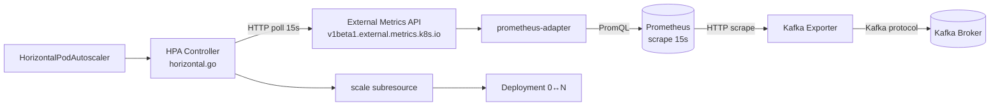
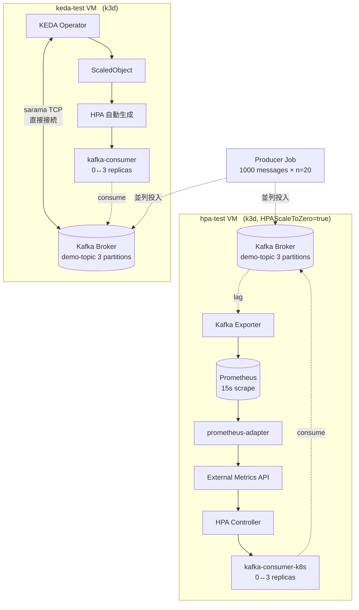
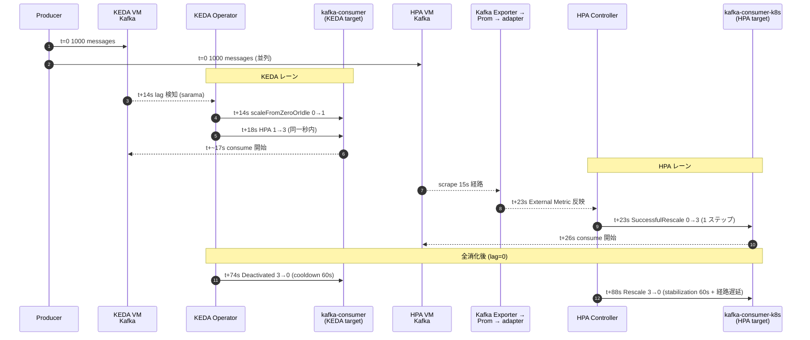
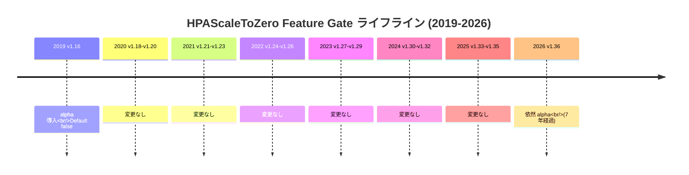
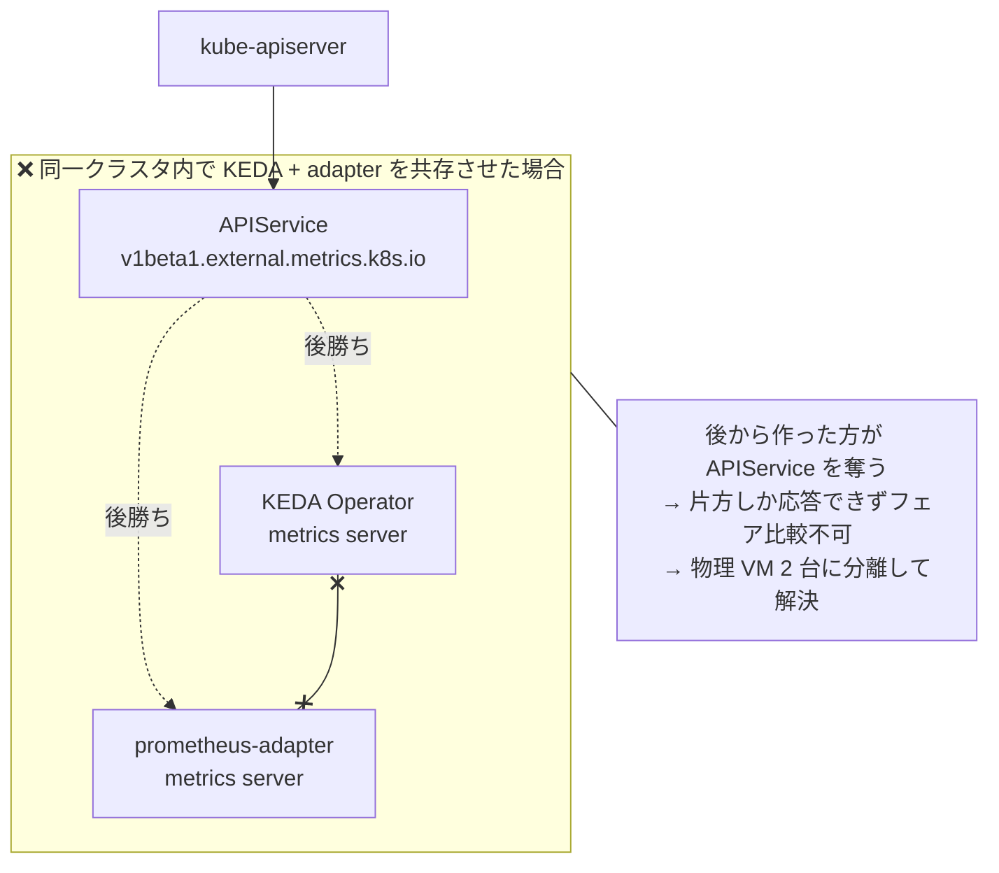
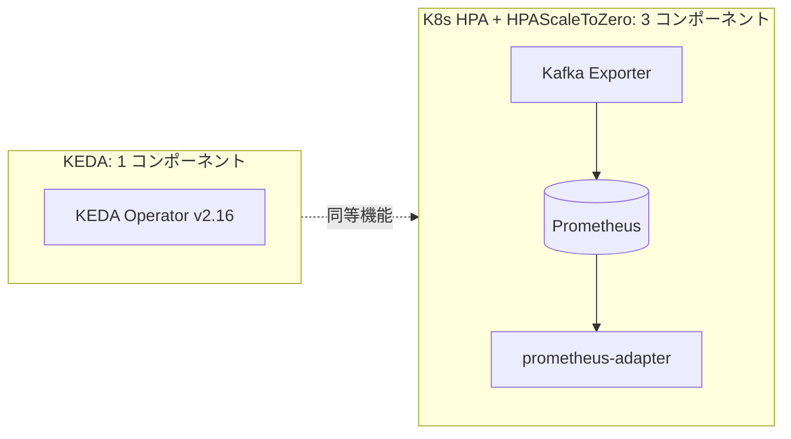
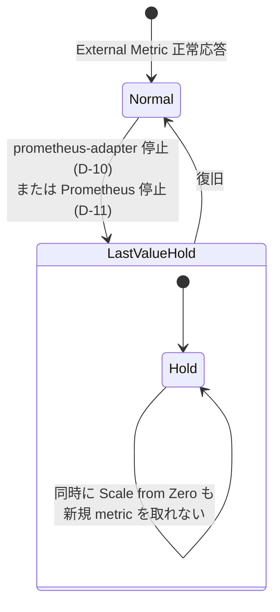
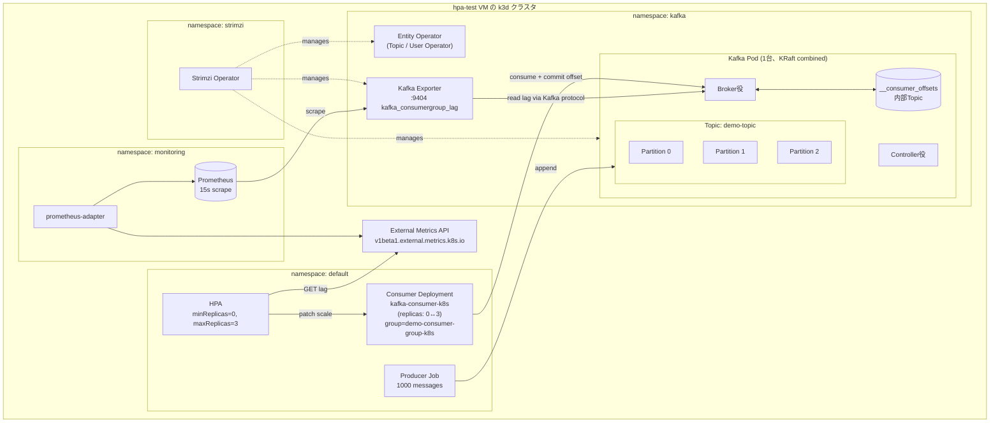

# blog-draft.md 用 図版ドラフト (Mermaid)

レビュー用に7枚を1ファイルにまとめたもの。OKならそのまま `blog-draft.md` に差し込む。

---

## ① §2.1 K8s HPA 制御フロー (新規追加)

KEDA 側だけ Mermaid 図があるので対比のために HPA 側も同粒度で追加。

**メッセージ**: 経路が 4 段（Exporter → Prom → adapter → External Metrics API）。後段の §6 で実測される ~9 秒のレイテンシ差はここに起因する。

---

## ② §4.2 2 VM 物理分離アーキテクチャ (ASCII art を差し替え)

**メッセージ**: 同じ Producer 入力に対して、左 = 4 段経路 (HTTP)、右 = 直接 TCP の 2 系統が同条件で並走している。

---

## ③ §6.1 タイムライン (ASCII を差し替え、n=20 平均)

`sequenceDiagram` で 2 レーン並列に表現。

**メッセージ**: KEDA は 14s/74s、HPA は 23s/88s。差分はそれぞれ +9s, +14s で §6.2 の Welch's t-test とほぼ一致。

---

## ④ §3 HPAScaleToZero alpha のライフライン

7 年塩漬けを時系列で見せる。

**メッセージ**: 20 リリース以上 alpha 据え置き。KEP プロセスの慣性が「実質マネージド K8s 不可」状況を作っている。

---

## ⑤ §4.1 APIService 衝突 (なぜ 2 VM 分離が必要か)

**メッセージ**: 既存実装で「同一クラスター上で並走比較」が見当たらない構造的理由を 1 枚で説明。

---

## ⑥ §8 コンポーネント数の対比

**メッセージ**: 機能が等価でも運用面のコンポーネント数が 1:3。FinOps/Platform 視点では決め手になる。

---

## ⑦ §7 障害時の状態遷移 (D-10 / D-11)

**メッセージ**: 「最後の値保持」は保護的な設計だが、副作用として「メトリクス源が消えると 0 化も復帰もできなくなる」という非対称な挙動を可視化。

---

## 差し込み先サマリ

| 図 | 対象セクション | 操作 |
|---|---|---|
| ① | §2.1 | 既存 K8s 説明文の直後に追加 (KEDA 図と並ぶ位置) |
| ② | §4.2 | 既存 ASCII art を **差し替え** |
| ③ | §6.1 | 既存テキストタイムラインを **差し替え** |
| ④ | §3 | `kube_features.go` 引用直後に追加 |
| ⑤ | §4.1 | 「同一クラスター内で共存できません」段落の直後に追加 |
| ⑥ | §8 | 比較表の前に追加 (運用面の主張を補強) |
| ⑦ | §7 | 表の直後に追加 |

