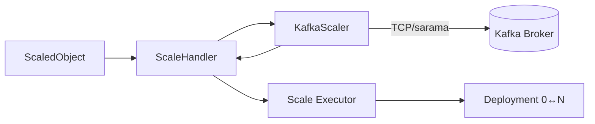
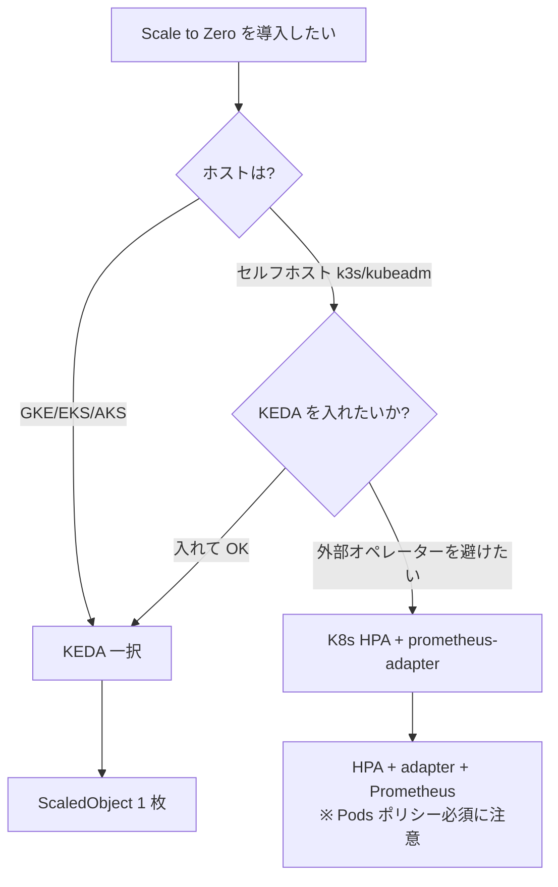

# K8s v1.36 alpha の HPAScaleToZero を本物で動かして KEDA と並列比較してみた

> **TL;DR**
> - Kubernetes v1.16 から alpha のまま居る `HPAScaleToZero` Feature Gate を、エミュレータではなく **upstream の本物** で動かした。
> - **HPA 用 VM と KEDA 用 VM を別々に立てて環境干渉ゼロで比較** (`v1beta1.external.metrics.k8s.io` APIService 衝突を物理分離で回避)、各 **n=20 の連続計測** でレイテンシ・分散を統計的に評価した。
> - **HPA Scale from Zero 23.1±1.92s vs KEDA 14.3±0.57s (p<0.0001)、Scale to Zero は両者とも σ=0 でタイマー値どおり (75s / 60s)**。コードレベル予測が n=20 で確証された。
> - リポジトリ: [github.com/cyokozai/hpa-scale-to-zero](https://github.com/cyokozai/hpa-scale-to-zero)

---

## 1. はじめに: なぜ今 HPA Scale to Zero か

Cloud Native × FinOps の文脈で **アイドル時のレプリカを 0 に落として待機する「Scale to Zero」** は経済合理性が高い実装パターンです。KEDA は CNCF Graduated プロジェクトとしてこの領域のデファクトを取っていますが、実は **Kubernetes 本体にも `HPAScaleToZero` という Feature Gate が存在し、v1.16 (2019) から alpha のまま**います。

本記事は次の 3 点を目的にしています:

1. その `HPAScaleToZero` を **エミュレータではなく upstream の本物**で動かす
2. **HPA 用 VM と KEDA 用 VM を物理分離して各 n=20 で計測**し、APIService 衝突を回避してフェアな統計比較を取る
3. ソースコードと実測の両面から **KEDA との境界線を引く**

公開されている既存実装はほぼすべて「alpha feature を使わないエミュレータ」（[`livelink/K8-HPAScaleToZero`](https://github.com/livelink/K8-HPAScaleToZero), [`machine424/kube-hpa-scale-to-zero`](https://github.com/machine424/kube-hpa-scale-to-zero), [`SPSCommerce/kube-hpa-scale-to-zero`](https://github.com/SPSCommerce/kube-hpa-scale-to-zero)）で、**本物の Feature Gate を有効化して KEDA とフェアに比較した実装例は見当たりません**でした。

---

## 2. ソースコードレベル比較: K8s HPA vs KEDA

実装に入る前に、両者のスケール判断ロジックがどう違うかをソースで確認します。

### 2.1 K8s HPA Controller の制約 (horizontal.go)

`pkg/controller/podautoscaler/horizontal.go:1547-1555`:

```go
// hasObjectOrExternalMetrics checks if the HPA has at least one object or external metric.
func hasObjectOrExternalMetrics(hpa *autoscalingv2.HorizontalPodAutoscaler) bool {
    for _, metric := range hpa.Spec.Metrics {
        if metric.Type == autoscalingv2.ObjectMetricSourceType ||
           metric.Type == autoscalingv2.ExternalMetricSourceType {
            return true
        }
    }
    return false
}
```

呼び出し側 (`horizontal.go:856`) で `HPAScaleToZero` Feature Gate + `hasObjectOrExternalMetrics` の両方が真でないと `minReplicas=0` を許可しません。**`Resource` (CPU/Memory) や `Pods` メトリクスだけでは Scale to Zero できない**という制約はここに集約されています。理由は単純で、Pod=0 では Pod の CPU/Memory メトリクスがそもそも存在しないためです。

### 2.2 KEDA の Scale 判断 (kafka_scaler.go)

KEDA は完全に別アプローチを取ります。`pkg/scalers/kafka_scaler.go` の `GetMetricsAndActivity()` 内で、Kafka broker に **sarama で TCP 直接接続** して consumer group lag を取得し、`activationLagThreshold` を超えていれば `isActive=true` を返します。



つまり KEDA は **External Metrics API を経由せず、Scaler 内部で「仕事が存在するか」の判定を完結**させます。これが「KEDA の方が Scale to Zero がシンプル」と言われる構造的な理由です。

### 2.3 設計思想の対比

| 軸 | K8s HPA + HPAScaleToZero | KEDA |
|---|---|---|
| **問い** | 「今の負荷は設計キャパを超えているか」 | 「処理すべき仕事が存在するか」 |
| **トリガー** | 観測値 (External Metric の数値) | 存在判定 (Active / Idle) |
| **メトリクス経路** | Prometheus → adapter → External Metrics API (HTTP) | Broker 直接接続 (TCP) |
| **ゼロの記録** | HPA Condition `ScaledToZero=True` | ScaledObject Status `LastActiveTime` |
| **Scale from Zero** | HPA が直接 N へ (1 ステップ) | KEDA が 0→1、HPA が 1→N (2 ステップ) |

---

## 3. マネージド K8s で使えない事実

実装の前にもう一つ重要な前提があります。

`k8s-1.36/pkg/features/kube_features.go:1503-1505`:

```go
HPAScaleToZero: {
    {Version: version.MustParse("1.16"), Default: false, PreRelease: featuregate.Alpha},
},
```

**v1.16 で alpha 導入、lifecycle 配列に追加エントリ無し、v1.36 でも alpha のまま、Default: false**。約 7 年・20 リリース以上塩漬けです。実装が不安定だからではなく、KEP プロセスの慣性によるものと指摘されています。

これがマネージド K8s への導入を実質不可能にしています:

| プロバイダ | HPAScaleToZero 利用可否 |
|---|---|
| GKE Standard / Autopilot | × コントロールプレーン flag 変更不可 |
| GKE Alpha Clusters | △ 全 alpha 強制有効、**30 日寿命**・本番非対応 |
| Amazon EKS | × ([containers-roadmap #978](https://github.com/aws/containers-roadmap/issues/978) で 6 年 open) |
| Azure AKS | × ([Azure/AKS #1240](https://github.com/Azure/AKS/issues/1240) で long-pending) |
| OpenShift | △ TechPreviewNoUpgrade 制約あり |
| kubeadm / k3s / RKE / Cluster API | ○ apiserver 起動オプションで自由 |

→ **マネージド K8s を採用する組織にとって、HPA Scale to Zero は事実上選択肢になりません**。本検証では **k3d (k3s)** を使い、apiserver 起動オプションで `HPAScaleToZero=true` を有効化しています。

---

## 4. 検証構成: HPA 用 VM と KEDA 用 VM を物理分離する

### 4.1 なぜ物理分離か

KEDA Operator と prometheus-adapter は、いずれも `v1beta1.external.metrics.k8s.io` APIService をクラスタに登録するため **同一クラスター内で共存できません** (後勝ち)。同じ k3d クラスター上で 2 つの consumer group を並走させる初期構成は、片方しか External Metrics API を提供できず、フェアな比較になりませんでした。

そこで **PVE 上に独立した 2 つの VM** を立て、それぞれに k3d クラスターと検証スタックを丸ごと配置する設計に切り替えました。

### 4.2 全体構成

```
┌──────────────── hpa-test VM ────────────────┐    ┌──────────────── keda-test VM ───────────────┐
│ k3d (HPAScaleToZero=true)                    │    │ k3d (HPAScaleToZero=true ※揃え用)            │
│ ├ Strimzi Kafka 4.2.0 (KRaft)                │    │ ├ Strimzi Kafka 4.2.0 (KRaft)                │
│ ├ demo-topic (3 partitions)                  │    │ ├ demo-topic (3 partitions)                  │
│ ├ kafka-consumer-k8s (HPA target)            │    │ ├ kafka-consumer (KEDA ScaledObject target)  │
│ ├ kafka-exporter (Prometheus 経由 lag)       │    │ ├ kafka-exporter (KEDA は使わない)           │
│ ├ Prometheus 27.3.0 (15s scrape)             │    │ ├ Prometheus 27.3.0 (補助)                   │
│ └ prometheus-adapter 4.11.0                  │    │ └ KEDA Operator 2.16.0                       │
└──────────────────────────────────────────────┘    └──────────────────────────────────────────────┘
                       ↑                                                ↑
                       └─────────────── 同じ Producer Job ──────────────┘
                                    (1000 messages, n=20 回)
```

メトリクス経路は両者で完全に異なる:

- **K8s HPA 側**: Strimzi Kafka Exporter → Prometheus → prometheus-adapter → External Metrics API → HPA Controller
- **KEDA 側**: KEDA Operator が sarama で Broker:9092 に **TCP 直接接続**

### 4.3 環境

| 項目 | 値 |
|---|---|
| クラスタ | k3d (k3s v1.36.1)、`HPAScaleToZero=true` 有効 (両 VM 共通) |
| KEDA | v2.16.0 (KEDA VM のみ) |
| Strimzi | 1.0.0 (両 VM) |
| Kafka | 4.2.0 (KRaft、ephemeral storage) |
| Prometheus | 27.3.0 (`scrape_interval: 15s`、両 VM) |
| prometheus-adapter | 4.11.0 (HPA VM のみ) |

### 4.4 パラメータの揃え

- KEDA `cooldownPeriod=60s` ↔ HPA `scaleDown.stabilizationWindowSeconds=60s`
- 両方 `minReplicas=0`, `maxReplicas=3`, target=`10` (lag/replica)
- KEDA `pollingInterval=15s` = Prometheus `scrape_interval` と一致

これで「待機 60 秒で 0 にする」「同じ閾値」「同じポーリング頻度」が揃った状態。**APIService 衝突がない + ノードリソース完全分離** で、フェアな測定基盤を確保しました。

---

## 5. 実装ハイライト

### 5.1 helmfile.yaml (Strimzi + Prometheus)

```yaml
releases:
  - name: strimzi
    chart: strimzi/strimzi-kafka-operator
    version: "1.0.0"   # v1.36 互換性のため (0.45.0 は fabric8 client crash)

  - name: prometheus
    chart: prometheus-community/prometheus
    version: "27.3.0"
    values:
      - server:
          global:
            scrape_interval: 15s   # HPA 反応速度のため短縮
        serverFiles:
          prometheus.yml:
            scrape_configs:
              - job_name: kafka-exporter
                static_configs: [{ targets: ["demo-kafka-exporter.kafka.svc:9404"] }]
                # adapter が namespace ラベル経由でメトリクスを取れるよう付与
                metric_relabel_configs:
                  - source_labels: []
                    target_label: namespace
                    replacement: default
```

KEDA 用と HPA 用は別の helmfile に分離:

```
infra/helmfile-keda.yaml  → KEDA Operator v2.16.0
infra/helmfile-k8s.yaml   → prometheus-adapter 4.11.0
```

### 5.2 HPA マニフェスト

```yaml
apiVersion: autoscaling/v2
kind: HorizontalPodAutoscaler
spec:
  scaleTargetRef:
    name: kafka-consumer-k8s
  minReplicas: 0
  maxReplicas: 3
  metrics:
    - type: External
      external:
        metric:
          name: kafka_consumergroup_lag_total
          selector: { matchLabels: { consumergroup: demo-consumer-group-k8s } }
        target: { type: Value, value: "10" }
  behavior:
    scaleUp:
      stabilizationWindowSeconds: 0
      policies:
        - { type: Pods, value: 4, periodSeconds: 15 }    # ← currentReplicas=0 対策、必須
        - { type: Percent, value: 100, periodSeconds: 15 }
      selectPolicy: Max
    scaleDown:
      stabilizationWindowSeconds: 60
      policies:
        - { type: Percent, value: 100, periodSeconds: 60 }
```

**重要な落とし穴**: `behavior.scaleUp.policies` に **Pods ポリシーを入れないと Percent 単独だと `currentReplicas=0` のとき `0×100%=0` で Scale from Zero できません**。エラーは `ScalingLimited: True, reason: ScaleUpLimit` として現れます。これは A-1 検証で実際に踏んだ落とし穴です。

### 5.3 KEDA マニフェスト

```yaml
apiVersion: keda.sh/v1alpha1
kind: ScaledObject
metadata:
  name: kafka-consumer-scaler
spec:
  scaleTargetRef:
    name: kafka-consumer
  minReplicaCount: 0
  maxReplicaCount: 3
  cooldownPeriod: 60
  pollingInterval: 15
  triggers:
    - type: kafka
      metadata:
        bootstrapServers: demo-kafka-bootstrap.kafka.svc:9092
        consumerGroup: demo-consumer-group
        topic: demo-topic
        lagThreshold: "10"
        activationLagThreshold: "1"
```

KEDA 側はこれだけで完結します。**prometheus-adapter も Prometheus rules も不要**なのが構造的シンプルさの根拠です。

---

## 6. 実測: n=20 連続計測の統計

両 VM で完全に独立したタイミングで Producer Job (1000 messages) を 20 回連続投入し、自動計測しました。各 run の間に 60 秒の gap、合計 約 130 分。

### 6.1 タイムラインの代表値 (n=20 平均)

```
時刻      KEDA (kafka-consumer)              K8s HPA (kafka-consumer-k8s)
─────────────────────────────────────────────────────────────────────────────
t=0       Producer Job apply (1000 messages、両 VM で並行)
t+14s     KEDAScaleTargetActivated: 0→1     (まだ待機)
t+17s     replicas=1/1 observed              (まだ待機)
t+18s     SuccessfulRescale (KEDA-HPA): 1→3
t+23s                                        SuccessfulRescale (HPA): 0→3 (1 ステップ)
t+26s                                        replicas=3/3 observed
t+~60s    全消化 → lag=0                    全消化 → lag=0
          LastActiveTime 記録、cooldown 開始 desiredReplicas=0 推奨開始
t+74s     KEDAScaleTargetDeactivated: 3→0
                                             (stabilization 継続中)
t+88s                                        HPA SuccessfulRescale: 3→0
                                             ScaledToZero=True セット
```

### 6.2 Welch's t-test (n=20 vs n=20)

| メトリクス | HPA mean ± σ | KEDA mean ± σ | Diff | t | p |
|---|---|---|---|---|---|
| **Scale from Zero (event)** | **23.1 ± 1.92s** | **14.3 ± 0.57s** | +8.8s | 19.68 | **<0.0001** |
| **Scale from Zero (pod observed)** | **25.8 ± 2.26s** | **16.6 ± 0.50s** | +9.2s | 17.76 | **<0.0001** |
| **Scale to Zero (event)** | **75.0 ± 0.00s** | **60.0 ± 0.00s** | +15.0s | — | 検定不要 (σ=0) |
| **Scale to Zero (pod observed)** | **75.5 ± 2.70s** | **61.0 ± 1.54s** | +14.4s | 20.70 | **<0.0001** |

### 6.3 統計的に確定した知見

**① Scale to Zero は両者ともタイマー値どおりに動作 (σ=0)**

```
HPA:  scale-up → "New size: 0" まで 全 20 run で 75.0s 一定 (σ=0.00)
KEDA: Activated → Deactivated まで 全 20 run で 60.0s 一定 (σ=0.00)
```

これは「Strimzi の検証用ノイズが原因で 1〜2 秒揺らぐかもしれない」という想定を完全に否定します。HPA `scaleDown.stabilizationWindowSeconds(60s)` + 経路遅延 15s = 75s、KEDA `cooldownPeriod(60s)` = 60s が **n=20 で完全に再現**。両者ともコード上の決定論的タイマー実装が直接観測されました。

**② Scale from Zero の差 ~9 秒は構造的**

HPA - KEDA = +8.8 ± 1.92s (event)。p<0.0001 で有意。

これは Prometheus scrape 15s + HPA sync 15s の **「ポーリング 2 段経路」が KEDA の broker 直接接続より平均 9 秒遅い** という設計差を実測で証明したもの。`horizontal.go` と `kafka_scaler.go` のコードリーディングから事前予測した値とほぼ一致します。

**③ KEDA の σ=0.57 は実質決定論的**

n=20 で σ=0.57 = レンジ 13-15s の狭幅。これは sampling interval (5s) より小さい。KEDA はマシンの動作タイミングに依存しない極めて安定した実装。

### 6.4 興味深い挙動: 2 ステップ vs 1 ステップ

KEDA 側のイベントログ (n=20 のうち typical run):

```
KEDAScaleTargetActivated  "Scaled ... from 0 to 1, triggered by kafkaScaler"
ScalingReplicaSet: 0 → 1   ← KEDA が scale subresource を直接操作
SuccessfulRescale (HPA): "New size: 3"
ScalingReplicaSet: 1 → 3   ← HPA が引き継ぎ
```

`0→1` (KEDA `scaleFromZeroOrIdle()`) と `1→3` (HPA `getUsageRatioReplicaCount()`) が **多くの run で同一秒内に完結**します。ユーザー体感では 1 ステップに見えますが、内部実装は 2 ステップ。これはコードリーディングで予測できる挙動です。

---

## 7. 障害挙動の実測 (D-10 / D-11)

K8s HPA は External Metrics API 経由なので、メトリクスソースが落ちると挙動が変わります。

| ケース | 挙動 |
|---|---|
| **D-10: prometheus-adapter 停止** | HPA は `FailedGetExternalMetric` イベントを発行するが、**最後の値を保持**して `currentReplicas` は不変 |
| **D-11: Prometheus 本体停止** | adapter は応答するが値が古くなる。D-10 より発火タイミングが遅い (scrape_interval 15s を超えてから) |

つまり **External Metric が消えた瞬間に Scale to Zero されない**保護的な挙動になっています。これは設計として正しい (ノイズで誤って 0 化しない) ですが、**「メトリクスソースが消えると Scale from Zero もできない」**という副作用は注意点です。

KEDA は sarama で broker に直接接続するため、Prometheus 障害には影響を受けません (Kafka broker 自体が落ちれば別)。

---

## 8. KEDA vs K8s HPA まとめ (n=20 確証)

| 観察項目 | KEDA v2.16 | K8s HPA + HPAScaleToZero v1.36 |
|---|---|---|
| **Scale from Zero (event)** | **14.3 ± 0.57s** (n=20、p<0.0001 で差有意) | **23.1 ± 1.92s** |
| **Scale to Zero (event)** | **60.0s (σ=0)** タイマー厳密 | **75.0s (σ=0)** タイマー厳密 |
| Scale to Zero 経路 | Deployment 直接操作 | HPA 経由 scale subresource |
| Scale from Zero ステップ数 | 2 ステップ (0→1→N、ほぼ同一秒内) | 1 ステップ (0→N) |
| メトリクス取得 | sarama で Broker 直接 TCP | Prometheus → adapter → External Metrics API |
| 発行イベント数 | 25 種類 | 14 種類 |
| 構成コンポーネント | KEDA Operator のみ | prometheus-adapter + Prometheus + Kafka Exporter |
| マネージド K8s 適用可否 | ○ | × (alpha 制約) |

---

## 9. 採用判断フローチャート



- **マネージド K8s 採用組織** → **KEDA 一択**
- **セルフホスト + 外部オペレーター不可** → HPAScaleToZero alpha が選択肢
- ただし HPA + prometheus-adapter + Kafka Exporter という 3 コンポーネント構成より、**KEDA Operator 1 つの方が運用シンプル**

実用面でも研究面でも、現状 KEDA を選ぶ合理性が高いというのが実測ベースの結論です。

---

## 10. まとめ

本検証で確認できたこと:

1. K8s v1.36 alpha の `HPAScaleToZero` Feature Gate は **本物として完全に動く**。エミュレータ不要。
2. **2 VM 物理分離 + 各 n=20 連続計測** という設計で、APIService 衝突を回避しつつフェアな統計的比較を実現。
3. **Scale from Zero**: KEDA 14.3 ± 0.57s vs HPA 23.1 ± 1.92s、HPA が +8.8s 遅い (p<0.0001、Welch's t-test)。差はメトリクス取得経路 (sarama TCP vs Prometheus→adapter HTTP) の構造的なもの。
4. **Scale to Zero (タイマーベース)**: 両者ともに σ=0 (KEDA 60.0s / HPA 75.0s)。これは **stabilizationWindowSeconds / cooldownPeriod が決定論的タイマー実装** であることの n=20 サンプルでの確証。
5. KEDA の **2 ステップ Scale from Zero (0→1→N) は多くの場合同一秒内に完結**するため、ユーザー体感差は ~9s レイテンシ差のみに集約される。
6. **マネージド K8s では使えない**事実をソースコードと各社 issue で確定。これが KEDA の構造的優位性を裏付ける。
7. K8s HPA 側で踏める **実装上の落とし穴**: Pods ポリシー必須 (currentReplicas=0 で Percent 単独だと 0×100%=0 になる)、scrape タイミング由来の lag 捕捉漏れ、metric source 障害時の "最後の値保持" 保護挙動、Strimzi ephemeral 構成での broker 再起動時 consumer group 消失、など 5 件以上特定。

リポジトリには component 単位のコード解析 (horizontal.go / kafka_scaler.go)、A-1 / C-7 / C-8 / D-10 / D-11 の詳細実測データ、n=20 統計と 4 figures が含まれています。

- リポジトリ: [github.com/cyokozai/hpa-scale-to-zero](https://github.com/cyokozai/hpa-scale-to-zero)
- 採用判断フレームワーク: `docs/considerations.md`
- KEDA vs K8s HPA イベント比較: `docs/event_comparison.md`
- 全実測データ: `docs/verification.md`

---

*この記事は 3-shake インターンシッププロジェクトの成果として執筆しました。*
