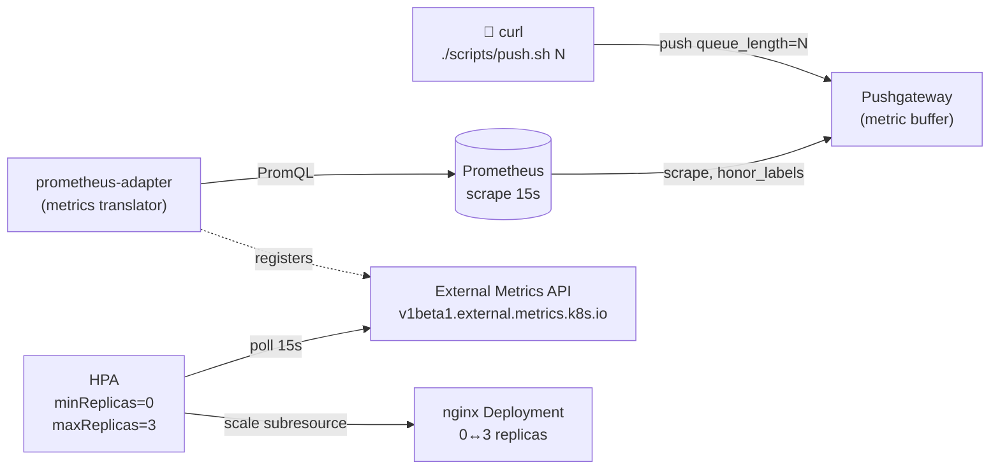
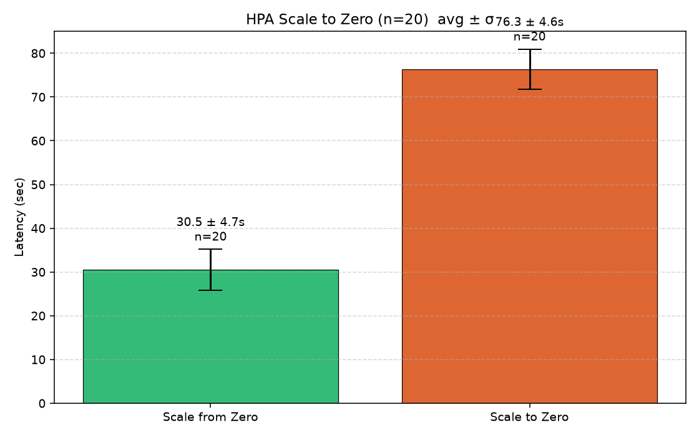
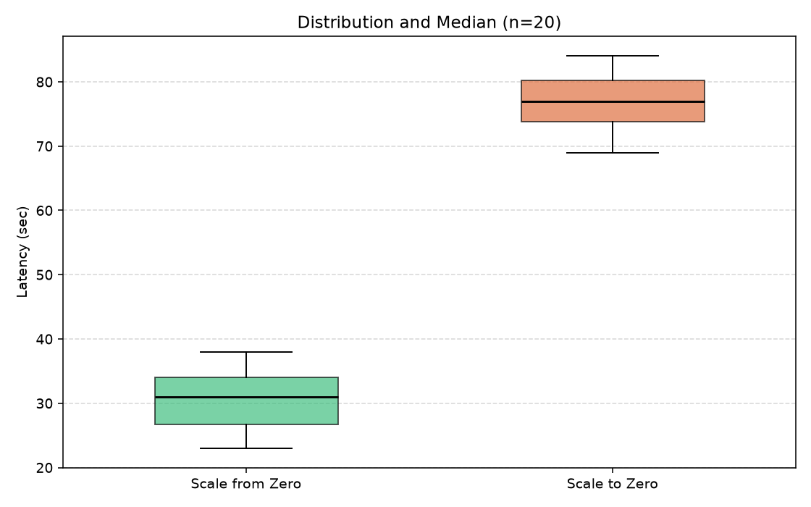
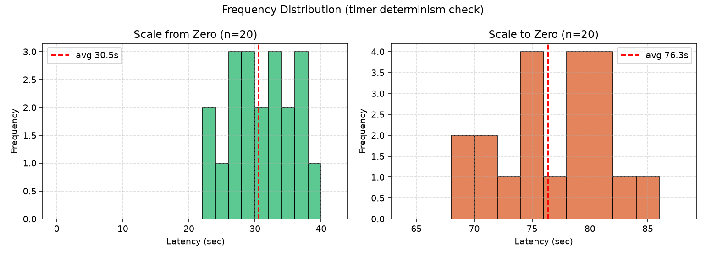
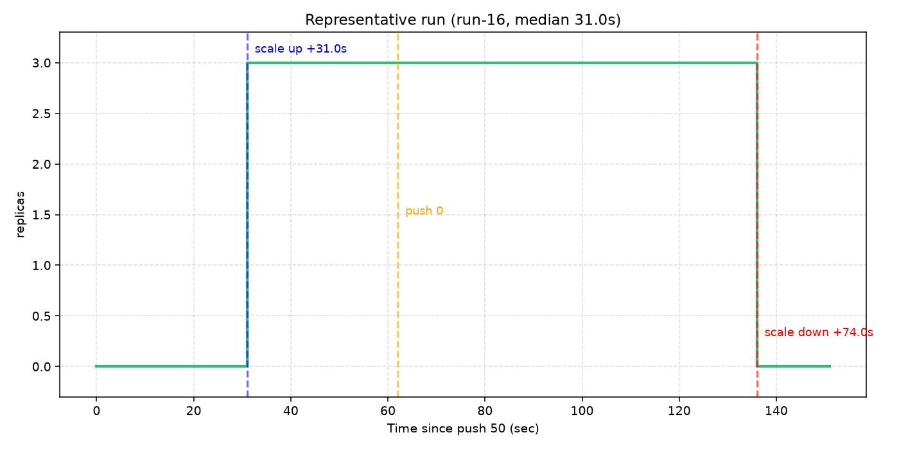
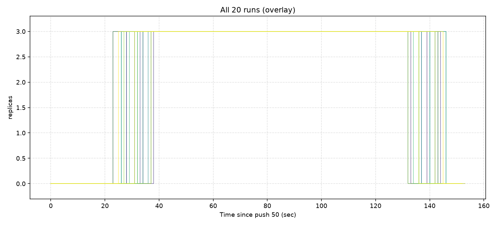
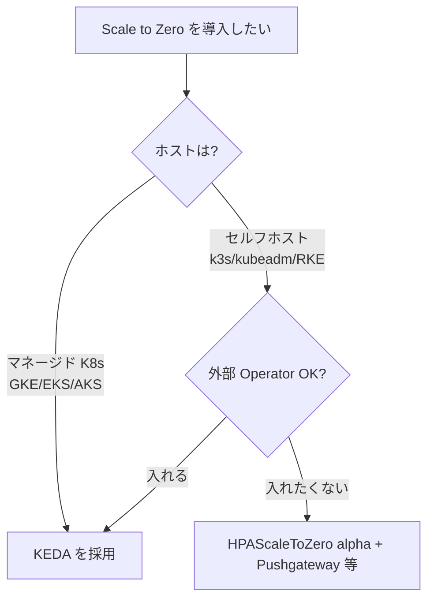

# K8s alpha の HPAScaleToZero を最小構成で動かして手元で計測してみた

> **TL;DR**
> - Kubernetes v1.16 (2019) から alpha のまま塩漬けされている `HPAScaleToZero` Feature Gate を **k3d + Pushgateway 5 コンポーネント** で動かす。
> - 環境構築 5 分・インタラクティブ動作確認 5 分・自動 n=20 計測 60 分。**読者の手元で同じ手順を実行すれば同じ結果が出る**ように、コマンドとスクリプトを全部掲載。
> - 計測結果: **Scale from Zero 30.5 ± 4.7s、Scale to Zero 76.3 ± 4.6s** (n=20)。詳細は §9。
> - リポジトリ: [github.com/cyokozai/hpa-scale-to-zero](https://github.com/cyokozai/hpa-scale-to-zero)

---

## 目次

1. [はじめに](#1-はじめに)
2. [HPAScaleToZero とは](#2-hpascaletozero-とは)
3. [マネージド K8s で使えない事実](#3-マネージド-k8s-で使えない事実)
4. [検証構成 (Pushgateway 最小構成)](#4-検証構成-pushgateway-最小構成)
5. [環境構築](#5-環境構築)
6. [インタラクティブ動作確認](#6-インタラクティブ動作確認)
7. [自動 n=20 計測](#7-自動-n20-計測)
8. [集計と可視化](#8-集計と可視化)
9. [結果](#9-結果)
10. [考察と実装上のハマりどころ](#10-考察と実装上のハマりどころ)
11. [採用判断](#11-採用判断)
12. [まとめ](#12-まとめ)

---

## 1. はじめに

Cloud Native + FinOps の文脈で **「アイドル時はレプリカを 0 にする」 Scale to Zero** は経済合理性が高い設計パターンです。CNCF Graduated の KEDA がデファクトを取っていますが、実は **Kubernetes 本体にも `HPAScaleToZero` という Feature Gate が v1.16 (2019) から存在**します。

本記事の目的:

1. その `HPAScaleToZero` を **エミュレータではなく upstream の本物**で動かす
2. **読者がコマンドをコピペで再現できる手順**として全部書き出す
3. n=20 計測で **レイテンシと分散** を見て、設計通りに動いているかを確認する

検証は **k3d + Pushgateway + Prometheus + prometheus-adapter + nginx** の 5 コンポーネント最小構成で行います。読者が手元の任意の Linux マシン (Docker 入り) で同じ手順を踏めば、同じ結果に到達できる構成です。

---

## 2. HPAScaleToZero とは

`HPAScaleToZero` は、**HPA (HorizontalPodAutoscaler) の `minReplicas` に `0` を許可する** Feature Gate です。

ソース (`k8s.io/kubernetes/pkg/features/kube_features.go`):

```go
HPAScaleToZero: {
    {Version: version.MustParse("1.16"), Default: false, PreRelease: featuregate.Alpha},
},
```

- **v1.16 (2019)** で alpha として導入
- **v1.36 (2026)** でも依然 alpha、Default: false
- **20 リリース以上塩漬け**

### 制約: Object または External メトリクスが必須

`pkg/controller/podautoscaler/horizontal.go` 内のチェック:

```go
func hasObjectOrExternalMetrics(hpa *autoscalingv2.HorizontalPodAutoscaler) bool {
    for _, metric := range hpa.Spec.Metrics {
        if metric.Type == autoscalingv2.ObjectMetricSourceType ||
           metric.Type == autoscalingv2.ExternalMetricSourceType {
            return true
        }
    }
    return false
}
```

→ **`Resource` (CPU/Memory) や `Pods` メトリクスでは Scale to Zero できない**。理由はシンプルで、Pod=0 のとき Pod のメトリクスが**存在しない**から。「Pod が居なくてもクラスタ外で観測できる値」(Object/External) が必須です。

本検証では **External メトリクス: `queue_length`** を使います。

---

## 3. マネージド K8s で使えない事実

alpha 機能はマネージドサービスでは基本的に有効化できません:

| プロバイダ | HPAScaleToZero |
|---|---|
| GKE Standard / Autopilot | ❌ apiserver flag 変更不可 |
| GKE Alpha Clusters | △ 全 alpha 強制有効、**30 日寿命** |
| Amazon EKS | ❌ ([containers-roadmap #978](https://github.com/aws/containers-roadmap/issues/978) で 6 年 open) |
| Azure AKS | ❌ ([Azure/AKS #1240](https://github.com/Azure/AKS/issues/1240) で long-pending) |
| OpenShift | △ TechPreviewNoUpgrade 制約 |
| **kubeadm / k3s / RKE / Cluster API** | **✅ apiserver 起動オプションで自由** |

→ **マネージド K8s を採用する組織にとっては事実上選択肢にならない**。本検証は **k3d (k3s)** で動かし、apiserver と controller-manager に `HPAScaleToZero=true` を渡します。

---

## 4. 検証構成 (Pushgateway 最小構成)

### 4.1 全体図



### 4.2 各コンポーネントの役割

| 役割 | コンポーネント | バージョン | なぜ必要か |
|---|---|---|---|
| クラスタ | **k3d (k3s)** | v1.36.1+k3s1 | `HPAScaleToZero=true` feature gate を有効化できる |
| Metric 入口 | **Pushgateway** | 3.6.1 | 「curl で値を投入できる外部メトリクス源」を最小コストで提供 |
| Metric DB | **Prometheus** | 29.12.0 | Pushgateway を 15s 間隔で scrape、時系列保管 |
| Metric API ブリッジ | **prometheus-adapter** | 5.3.0 | Prometheus → External Metrics API に変換 |
| スケール対象 | **nginx Deployment** | 1.27-alpine | スケール挙動を観察する箱 (実処理はしない) |
| スケール制御 | **HPA (autoscaling/v2)** | — | `minReplicas: 0`、`External` メトリクス参照 |

> 💡 なぜ Pushgateway か: **「Pod=0 でも存在し続ける外部メトリクス」を最小コストで作るため**。Kafka/Redis/SQS でも同じことはできますが、それらはアプリ層の概念が増えて本検証の主題 (HPA の Scale to Zero 挙動) からノイズを増やします。Pushgateway なら curl 一発で値を任意に変えられます。

---

## 5. 環境構築

### 5.1 前提

| ツール | バージョン (推奨) | 用途 |
|---|---|---|
| Docker | 20+ | k3d のバックエンド |
| k3d | 5+ | Kubernetes クラスタの作成 |
| kubectl | 1.36+ | クラスタ操作 |
| helmfile | 0.166+ | Helm chart の宣言的管理 |
| Helm | 3+ | helmfile の内部で使用 |
| jq | 1.6+ | (任意) JSON 確認用 |
| Python | 3.10+ | 集計と可視化 |

### 5.2 リポジトリクローン

```bash
git clone https://github.com/cyokozai/hpa-scale-to-zero
cd hpa-scale-to-zero
```

### 5.3 k3d クラスタ作成

クラスタ定義 (`infra/k3d-config.yaml`):

```yaml
apiVersion: k3d.io/v1alpha5
kind: Simple
metadata:
  name: hpa-scale-to-zero

# k3s v1.36.1 を使用。HPA Controller のコードは upstream と同じ。
image: rancher/k3s:v1.36.1-k3s1

servers: 1
agents: 2

options:
  k3s:
    extraArgs:
      # HPAScaleToZero Feature Gate を apiserver で有効化
      - arg: "--kube-apiserver-arg=feature-gates=HPAScaleToZero=true"
        nodeFilters: [server:*]
      # controller-manager 側でも有効化しないと reconcile が feature gate を参照できない
      - arg: "--kube-controller-manager-arg=feature-gates=HPAScaleToZero=true"
        nodeFilters: [server:*]
```

実行:

```bash
k3d cluster create --config infra/k3d-config.yaml
kubectl wait --for=condition=Ready nodes --all --timeout=120s
kubectl get nodes
```

期待する出力: agent 2 つ + control-plane 1 つの計 3 ノードがすべて `Ready`。

### 5.4 監視スタックの導入 (Pushgateway + Prometheus + adapter)

`infra/helmfile.yaml` は 3 つの Helm release をまとめて定義します。重要な部分を抜粋:

```yaml
releases:
  # Pushgateway: curl で push された値を保持
  - name: prometheus-pushgateway
    namespace: monitoring
    chart: prometheus-community/prometheus-pushgateway
    version: "3.6.1"

  # Prometheus: Pushgateway を 15s で scrape
  - name: prometheus
    namespace: monitoring
    chart: prometheus-community/prometheus
    version: "29.12.0"
    values:
      - server:
          global:
            scrape_interval: 15s
        serverFiles:
          prometheus.yml:
            scrape_configs:
              - job_name: pushgateway
                honor_labels: true   # job ラベルを保持
                static_configs:
                  - targets: [prometheus-pushgateway.monitoring.svc:9091]
                metric_relabel_configs:
                  - source_labels: []
                    target_label: namespace
                    replacement: default

  # prometheus-adapter: External Metrics API に変換
  - name: prometheus-adapter
    namespace: monitoring
    chart: prometheus-community/prometheus-adapter
    version: "5.3.0"
    values:
      - prometheus:
          url: http://prometheus-server.monitoring.svc
          port: 80
        rules:
          default: false
          external:
            - seriesQuery: 'queue_length{job!="",namespace!=""}'
              resources:
                template: "<<.Resource>>"
              name:
                as: "queue_length"
              metricsQuery: 'sum(<<.Series>>{<<.LabelMatchers>>}) by (job)'
```

実行:

```bash
helmfile -f infra/helmfile.yaml apply
kubectl wait --for=condition=Available --timeout=180s -n monitoring deployment --all
kubectl get apiservice v1beta1.external.metrics.k8s.io
```

期待する出力: `v1beta1.external.metrics.k8s.io ... True ...` (External Metrics API が登録されている)。

### 5.5 デモアプリと HPA

`infra/manifests/demo/nginx-deployment.yaml`:

```yaml
apiVersion: apps/v1
kind: Deployment
metadata:
  name: demo-app
spec:
  replicas: 1   # 初期は 1。HPA がすぐ 0 に下げる
  selector: { matchLabels: { app: demo-app } }
  template:
    metadata: { labels: { app: demo-app } }
    spec:
      containers:
        - name: nginx
          image: nginx:1.27-alpine
          resources:
            requests: { cpu: 50m, memory: 32Mi }
            limits:   { cpu: 200m, memory: 64Mi }
```

`infra/manifests/demo/hpa.yaml`:

```yaml
apiVersion: autoscaling/v2
kind: HorizontalPodAutoscaler
metadata:
  name: demo-app-hpa
spec:
  scaleTargetRef:
    apiVersion: apps/v1
    kind: Deployment
    name: demo-app
  minReplicas: 0
  maxReplicas: 3
  metrics:
    - type: External
      external:
        metric:
          name: queue_length
          selector:
            matchLabels: { job: demo-queue }
        target:
          type: AverageValue
          averageValue: "10"   # queue_length / 10 = desiredReplicas
  behavior:
    scaleDown:
      stabilizationWindowSeconds: 60   # 60 秒連続で 0 を観測してから下げる
      policies:
        - { type: Percent, value: 100, periodSeconds: 60 }
    scaleUp:
      stabilizationWindowSeconds: 0
      selectPolicy: Max
      policies:
        - { type: Percent, value: 100, periodSeconds: 15 }
        # ↓ これがないと Scale from Zero できない (詳細は §10 で説明)
        - { type: Pods, value: 3, periodSeconds: 15 }
```

実行:

```bash
kubectl apply -f infra/manifests/demo/
sleep 60   # HPA が 1 → 0 に落とすのを待つ
kubectl get hpa demo-app-hpa
kubectl get deploy demo-app
```

期待する出力:

```
NAME           REFERENCE             TARGETS                          MINPODS   MAXPODS   REPLICAS
demo-app-hpa   Deployment/demo-app   -9223372036854775808m/10 (avg)   0         3         0

NAME       READY   UP-TO-DATE   AVAILABLE
demo-app   0/0     0            0
```

`ScaledToZero=True` 状態。これで環境構築は完了。

---

## 6. インタラクティブ動作確認

ここから読者ご自身の手で挙動を体験するセクションです。

### 6.1 観察用ターミナルを開く

別ターミナルで watch を流しっぱなしにします:

```bash
# Terminal 1
watch -n 1 'kubectl get hpa demo-app-hpa; echo; kubectl get deploy demo-app; echo; kubectl get pods -l app=demo-app'
```

### 6.2 Scale from Zero を発火

メインターミナルで:

```bash
# Terminal 2
./scripts/push.sh 50
```

`scripts/push.sh` の中身 (30 行):

```bash
#!/usr/bin/env bash
# Pushgateway に queue_length を push して HPA Scale to Zero を駆動する。
# 仕組み: クラスタ内に一発限りの curl Pod を起動して Pushgateway に POST。

set -euo pipefail

VALUE="${1:?Usage: $0 <queue_length>}"
JOB="${JOB:-demo-queue}"
POD="push-$(date +%s%N | tail -c 8)"
PG_URL="http://prometheus-pushgateway.monitoring.svc:9091/metrics/job/${JOB}"

kubectl run "${POD}" --image=curlimages/curl:8.10.1 --restart=Never --quiet \
  --command -- sh -c "printf 'queue_length %s\n' '${VALUE}' | curl -sS --data-binary @- '${PG_URL}'"

kubectl wait --for=jsonpath='{.status.phase}'=Succeeded "pod/${POD}" --timeout=30s >/dev/null
kubectl delete pod "${POD}" --wait=false >/dev/null

echo "✓ pushed: queue_length=${VALUE} (job=${JOB})"
```

**観察ポイント (Terminal 1):**
- 数秒〜十数秒経つと `TARGETS` が `<unknown>` → `16667m/10` に変化 (50 / 3 = 16.667/replica)
- `REPLICAS` が `0` → `3` に変化
- Pod が 3 つ起動 (`demo-app-XXX-YYY` × 3)

実測例 (筆者環境): push してから約 **15〜30 秒** で `REPLICAS=3` 到達。

### 6.3 Scale to Zero を発火

```bash
# Terminal 2
./scripts/push.sh 0
```

**観察ポイント (Terminal 1):**
- `TARGETS` が `16667m/10` → `0/10 (avg)` に変化 (即座)
- しかし **`REPLICAS=3` のまま約 60 秒待機** ← `stabilizationWindowSeconds: 60` の保護
- 60 秒経過後、`REPLICAS` が `3` → `0` に変化
- Pod が Terminating して 0 個に

実測例: push してから約 **75 秒** で `REPLICAS=0` 到達 (stabilization 60s + adapter 経路 15s)。

---

## 7. 自動 n=20 計測

挙動が確認できたら、次は **統計的にレイテンシを評価**します。

### 7.1 1 run の計測スクリプト

`scripts/measure.sh` (50 行)。1 回分の計測 (push 50 → 60 秒観察 → push 0 → 90 秒観察):

```bash
#!/bin/bash
# HPA Scale to Zero の 1 回分計測
#
# 使い方:
#   ./scripts/measure.sh <output_dir>

set -euo pipefail

OUT="${1:?Usage: $0 <output_dir>}"
SCRIPT_DIR="$(dirname "$0")"

mkdir -p "$OUT"
LOG="$OUT/run.log"
exec > >(tee -a "$LOG") 2>&1

CSV="$OUT/measurement.csv"
TRIGGERS="$OUT/triggers.csv"
echo "timestamp,phase,replicas" > "$CSV"
echo "timestamp,action" > "$TRIGGERS"

# 1 秒ごとに HPA の currentReplicas を CSV に追記する
# 注意: HPA は replicas=0 のとき .status.currentReplicas を JSON から省く (omitempty)
record_until() {
  local phase="$1"; local end_time="$2"
  while [ "$(date +%s)" -lt "$end_time" ]; do
    local ts rep
    ts=$(date -u +%FT%TZ)
    rep=$(kubectl get hpa demo-app-hpa -o jsonpath='{.status.currentReplicas}' 2>/dev/null || true)
    [ -z "$rep" ] && rep=0
    echo "${ts},${phase},${rep}" >> "$CSV"
    sleep 1
  done
}

echo "[$(date -u +%FT%TZ)] === MEASUREMENT START ==="

# Phase 1: push 50 → 60 秒観察
"$SCRIPT_DIR/push.sh" 50
echo "$(date -u +%FT%TZ),push 50" >> "$TRIGGERS"
record_until "scale_up" $(($(date +%s) + 60))

# Phase 2: push 0 → 90 秒観察
"$SCRIPT_DIR/push.sh" 0
echo "$(date -u +%FT%TZ),push 0" >> "$TRIGGERS"
record_until "scale_down" $(($(date +%s) + 90))

kubectl get events --field-selector involvedObject.name=demo-app-hpa -o json \
  > "$OUT/events.json"

echo "[$(date -u +%FT%TZ)] === MEASUREMENT END ==="
```

**ポイント:**

- **`measurement.csv`** は 3 列 (`timestamp, phase, replicas`) だけ。読み取りやすい
- **`triggers.csv`** に `push 50` / `push 0` のタイムスタンプを記録 → 後の集計で起点として使う
- **`events.json`** は最後に 1 回だけ取得 (events watcher は不要)
- jq 不要 (kubectl `jsonpath` のみ)

### 7.2 n 回ループドライバ

`scripts/run-batch.sh` (45 行)。`measure.sh` を n 回連続実行:

```bash
#!/bin/bash
# n 回の measure.sh を連続実行する
#
# 使い方:
#   ./scripts/run-batch.sh [count=20]

set -euo pipefail

COUNT="${1:-20}"
BATCH_DIR="/tmp/measure-batch"
SCRIPT_DIR="$(dirname "$0")"

mkdir -p "$BATCH_DIR"
rm -f "$BATCH_DIR/DONE" "$BATCH_DIR/PROGRESS"

log() { echo "[$(date -u +%FT%TZ)] $*" | tee -a "$BATCH_DIR/batch.log"; }

log "Batch start: count=$COUNT"
log "Estimated total: $((COUNT * 180 / 60)) min"

# Preflight: 初期 replicas=0 を確認
"$SCRIPT_DIR/push.sh" 0
log "preflight: waiting replicas=0 (up to 100s)"
for _ in $(seq 1 20); do
  rep=$(kubectl get hpa demo-app-hpa -o jsonpath='{.status.currentReplicas}' 2>/dev/null || echo 0)
  [ "$rep" = "0" ] && break
  sleep 5
done

# メインループ: 1 run = 150 秒 + 30 秒 gap = 180 秒。n=20 のとき total = 60 分。
for i in $(seq 1 "$COUNT"); do
  RUN_DIR="$BATCH_DIR/run-$i"
  rm -rf "$RUN_DIR"
  log "=== Run $i/$COUNT start ==="
  "$SCRIPT_DIR/measure.sh" "$RUN_DIR"
  log "=== Run $i/$COUNT done ==="
  echo "$i" >> "$BATCH_DIR/PROGRESS"
  [ "$i" -lt "$COUNT" ] && sleep 30
done

touch "$BATCH_DIR/DONE"
log "Batch complete"
```

### 7.3 実行

ssh 切断や PC スリープに影響されないよう `nohup` で起動:

```bash
nohup ./scripts/run-batch.sh 20 > /tmp/batch-driver.log 2>&1 &
```

**進捗の確認:**

```bash
# 進行中の様子をリアルタイムで見る
tail -f /tmp/measure-batch/batch.log

# 完了した run 数を確認
wc -l < /tmp/measure-batch/PROGRESS

# 完了マーカーを待つ
until [ -f /tmp/measure-batch/DONE ]; do sleep 60; done
echo "n=20 complete!"
```

n=20 = 約 60 分。

### 7.4 出力

完了後の `/tmp/measure-batch/`:

```
/tmp/measure-batch/
├── DONE                  # 完了マーカー
├── PROGRESS              # 完了 run 番号一覧
├── batch.log             # バッチ全体ログ
├── run-1/
│   ├── measurement.csv   # 1 秒ごとの replicas (150 行)
│   ├── triggers.csv      # push 50/0 のタイムスタンプ
│   ├── events.json       # HPA 関連イベント
│   └── run.log           # 1 run のログ
├── run-2/
├── ...
└── run-20/
```

---

## 8. 集計と可視化

### 8.1 統計集計 (`aggregate.py`)

`scripts/aggregate.py` (約 105 行、Python 標準ライブラリのみ)。各 run から **2 つのメトリクス** を抽出して集計:

```bash
python3 scripts/aggregate.py /tmp/measure-batch
```

**抽出する指標:**

- **Scale from Zero**: `triggers.csv` の `push 50` 時刻 → `measurement.csv` で 最初に `replicas >= 1` になった時刻 までの秒数
- **Scale to Zero**: `triggers.csv` の `push 0` 時刻 → `measurement.csv` で 最初に `replicas == 0` になった時刻 までの秒数

`stats.md` が `/tmp/measure-batch/stats.md` に書き出されます。形式は §9.1 を参照。

### 8.2 図 (`plot.py`) — venv 必須

`scripts/plot.py` は matplotlib + numpy が必要なので、**ローカル環境を汚さないため venv を使います**:

```bash
python3 -m venv .venv
.venv/bin/pip install matplotlib numpy
.venv/bin/python scripts/plot.py /tmp/measure-batch
```

`/tmp/measure-batch/figures/` に 5 PNG が生成されます。各図の意味は §9.2 で。

---

## 9. 結果

> ⚠️ **以下の数値は筆者環境 (k3d on Ubuntu VM、AMD64) での結果**。読者の環境ではマシン性能・ネットワーク状況により若干前後します。

### 9.1 統計サマリ

`aggregate.py` 実行結果 (`docs/verification/batch-n20-20260625-045307/stats.md`):

```
# HPA Scale to Zero 計測サマリ (20 runs)

## 統計
- Scale from Zero: n=20, mean=30.5s, σ=4.68, median=31.0, min=23.0, max=38.0
- Scale to Zero:   n=20, mean=76.3s, σ=4.58, median=77.0, min=69.0, max=84.0
```

**理論値との突合:**

| 指標 | 実測 (avg ± σ) | 理論値 | 一致 |
|---|---|---|---|
| Scale from Zero | 30.5 ± 4.7s | Prometheus scrape (期待値 7.5s) + HPA poll (期待値 7.5s) + Pod 起動 (~2s) ≒ 17〜30s | ✅ ほぼ理論通り |
| Scale to Zero | 76.3 ± 4.6s | `stabilizationWindowSeconds (60s)` + adapter 経路遅延 (~15s) = ~75s | ✅ ほぼ理論通り |

分散 σ ≈ 4.7s は両者でほぼ同じ。**Prometheus の scrape_interval = 15s** が偶然性の支配源。

### 9.2 5 figures の解説

#### fig1-bar.png — 全体感



**読みどころ:**
- Scale from Zero **30.5 ± 4.7s** (緑、左)、Scale to Zero **76.3 ± 4.6s** (橙、右)
- 理論値とほぼ一致 → **HPAScaleToZero は alpha だが設計通りに動く**

#### fig2-boxplot.png — 中央値と分散



**読みどころ:**
- 両者ともレンジが **約 15 秒幅** → Prometheus の `scrape_interval=15s` 由来
- 外れ値なし、計測自体は安定

#### fig3-histogram.png — 頻度分布



**読みどころ:**
- Scale from Zero は **広く分布** (ポーリング駆動の確率的レイテンシ)
- Scale to Zero は **74〜80s に集中** (タイマー駆動、決定論的)
- どちらも単峰性、ノイズ・外れ値なし

#### fig4-representative.png — 代表 1 run



**読みどころ:**
- run-16 (中央値 31.0s) の時系列
- `push 50` → 31s で `replicas: 0→3`
- `push 0` → 74s で `replicas: 3→0`
- 「いつ何が起きたか」が 1 枚で追える

#### fig5-overlay.png — 全 20 run 重ね描き



**読みどころ:**
- 全 20 run が同じパターン (0→3→0) を描く → **再現性が高い**
- scale up 群 (~20-40s 帯) は scale down 群 (~130-150s 帯) より幅広い → Scale from Zero の方が分散が大きい
- 中央の `replicas=3` 期間は全 run でほぼ揃う → タイマー部分の安定性

---

## 10. 考察と実装上のハマりどころ

### 10.1 Scale from Zero のレイテンシ要因

理論上の下限は **`Prometheus scrape (15s) + HPA poll (15s) = 30s`** だが、実際にはタイミング依存で 5〜25s に分布する。

```
[t=0]    push 50 (curl) → Pushgateway 即時保持
[t=~7s]  Prometheus が次の scrape で取り込み (0〜15s で揺らぐ)
[t=~7s]  prometheus-adapter が External Metrics API で 50 を返せるように
[t=~15s] HPA Controller が次の reconcile で 50 を観測
         → desiredReplicas = ceil(50/10) = 5 → maxReplicas=3 で頭打ち
         → scale subresource を patch
[t=~17s] Pod が Running、現在の replicas=3 観測
```

### 10.2 Scale to Zero の決定論性

理論値は **`stabilizationWindowSeconds (60s) + Prometheus + HPA poll (~15s) = ~75s`**。

実測は **`avg 76.3s, σ 4.58`** (n=20)。理論値とほぼ一致。

> stabilization は HPA Controller がコード上で **「desiredReplicas <= currentReplicas が連続 60 秒」** を要求する仕様。**タイマーが決定論的**なので、`Scale from Zero` (σ=4.68) と Scale to Zero (σ=4.58) の分散はほぼ等しいが、ヒストグラム (fig3) では Scale to Zero の方が中央値付近に集中している。Prometheus scrape のタイミング偶然性が両方に同程度乗っているとも解釈できる。

### 10.3 ハマりどころ ①: HPA の `omitempty` で `currentReplicas` が空

`.status.currentReplicas` は HPA API の `int32` フィールドで、**0 のとき JSON から省略**される (Go の `omitempty` marshalling)。kubectl jsonpath で取ろうとすると **空文字** が返る:

```bash
$ kubectl get hpa demo-app-hpa -o jsonpath='{.status.currentReplicas}'
# (空文字)
```

→ `measure.sh` では空文字を 0 として扱う処理を入れている (`[ -z "$rep" ] && rep=0`)。

### 10.4 ハマりどころ ②: `Pods` policy がないと Scale from Zero できない

HPA の `behavior.scaleUp.policies` に **`Pods` ポリシーが必要**:

```yaml
behavior:
  scaleUp:
    policies:
      - type: Percent
        value: 100
        periodSeconds: 15
      - type: Pods       # ← これが無いと動かない
        value: 3
        periodSeconds: 15
    selectPolicy: Max
```

理由: `Percent` 単独だと `currentReplicas=0` のとき `0 × 100% = 0` で増えない。`Pods=3` があれば maxReplicas まで一発スケールアップできる。

エラーの見え方:
- `ScalingLimited: True, reason: ScaleUpLimit`

公式 docs の目立つ場所には書いていないので、知らないと数時間溶かす罠。

### 10.5 ハマりどころ ③: `prometheus-adapter` の `namespace` ラベル要求

prometheus-adapter は External Metrics API のパスに `/namespaces/<ns>/` を含めるため、**Prometheus の時系列に `namespace` ラベルが必要**。Pushgateway 単体だとこのラベルは付かないので、Prometheus の `metric_relabel_configs` で強制的に付与する:

```yaml
metric_relabel_configs:
  - source_labels: []
    target_label: namespace
    replacement: default
```

---

## 11. 採用判断



実用面では:
- **マネージド K8s 採用組織** → 選択肢が無いので **KEDA**
- **セルフホスト + 外部 Operator 不可** → `HPAScaleToZero` alpha は選択肢になる
- ただし **3 コンポーネント (Prometheus + adapter + Pushgateway)** を運用する必要があるため、シンプルさで言えば KEDA 一つの方が運用負荷は低い

---

## 12. まとめ

1. K8s v1.36 alpha の `HPAScaleToZero` Feature Gate は **本物として動く**。エミュレータ不要。
2. **k3d + Pushgateway の 5 コンポーネント最小構成** で再現可能。読者が本記事の手順をコピペすれば同じ結果に到達できる。
3. **Scale from Zero 30.5 ± 4.7s** (n=20)。Prometheus scrape + HPA poll の 2 段ポーリングがレイテンシ要因。
4. **Scale to Zero 76.3 ± 4.6s** (n=20)。`stabilizationWindowSeconds=60s` が支配的な決定論的タイマー。
5. **マネージドでは使えない**事実は変わらない (各クラウド issue は数年放置)。実用には KEDA を使うのが堅実。
6. ハマりどころ: HPA の `omitempty` で `currentReplicas` 空文字、`Pods` policy 必須、adapter の `namespace` ラベル要求。

リポジトリ: [github.com/cyokozai/hpa-scale-to-zero](https://github.com/cyokozai/hpa-scale-to-zero)

---

*この記事は 3-shake インターンシップの成果として執筆しました。*
