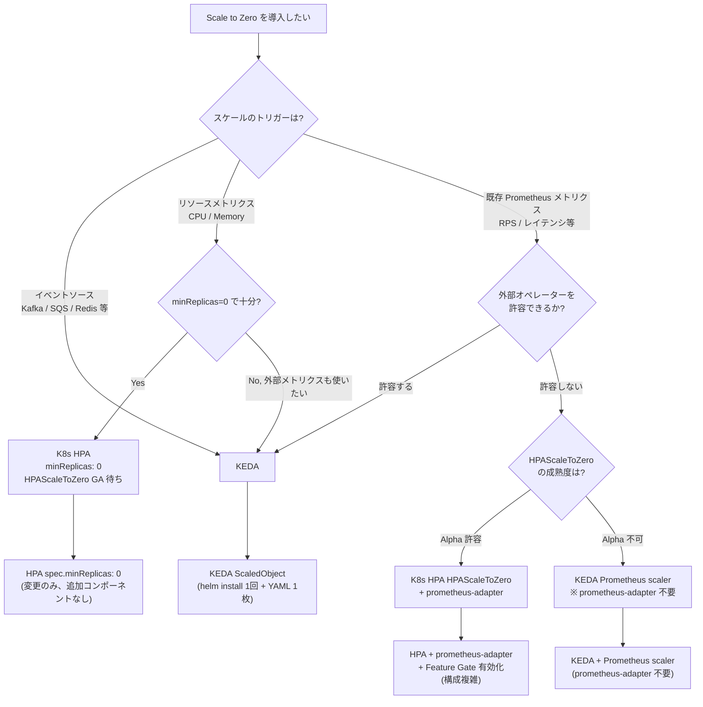

# 考察: Scale to Zero 実践適用と採用判断

## 本ドキュメントの位置付け

`requirements.md` では「プロダクション運用設計は除外スコープ」としていたが、
コード解析・検証を通じて得られた知見を実践シナリオへ接続するため、
本ドキュメントにまとめる。

---

## 1. 採用判断のフレームワーク

コード解析と実測（`verification.md`）から、Scale to Zero の採用判断は
**「何をトリガーにするか」** と **「外部オペレーターを許容するか」** の 2 軸で整理できる。



---

## 2. 本質的な分割軸

今回の検証で明らかになった本質的な差異は **「シンプルさ」ではなく「設計思想」** にある。

| 軸 | K8s HPA HPAScaleToZero | KEDA |
|---|---|---|
| **スケールの問い** | "今の負荷は設計キャパを超えているか" | "処理すべき仕事が存在するか" |
| **トリガーの性質** | 観測値（メトリクス）| 存在判定（キューの有無）|
| **ゼロの意味** | 負荷が閾値を下回り続けた結果 | 仕事がなくなった結果 |
| **メトリクス取得** | Prometheus → External Metrics API（HTTP）| Broker 直接接続（TCP）|
| **実装の場所** | HPA ループ外側（`horizontal.go`）| Scaler 内部（`kafka_scaler.go`）|

コード上の対応（`component2/` 参照）:

```
K8s HPA:  hasObjectOrExternalMetrics() → shouldComputeMetricsForZeroReplicas()
          → ScaledToZero Condition で状態を外部に露出

KEDA:     GetMetricsAndActivity() 内で totalLag > activationLagThreshold を判定
          → isActive を Scaler 内部で完結させ、上位レイヤーに伝播
```

---

## 3. 「KEDA よりシンプル」という訴求の正確な条件

**「K8s HPA の方がシンプル」が成立するのは以下の条件が揃う場合に限られる。**

### 成立する条件

```
① スケールトリガーが CPU / Memory のみ
   → External Metrics API 不要
   → Prometheus も prometheus-adapter も不要
   → HPA の spec.minReplicas を 0 にするだけ

② HPAScaleToZero の GA を待てる
   → v1.36 時点では Alpha、Feature Gate の明示指定が必要
   → プロダクション導入はリスクを伴う
```

このケース（CPU/Memory のみ）では確かに K8s HPA が最もシンプルであり、
KEDA を導入する理由がない。

### 成立しない条件（外部メトリクスを使う場合）

```
Kafka lag 等の外部メトリクスで Scale to Zero する場合:

K8s HPA の必要スタック:
  Feature Gate 有効化（kube-apiserver + kube-controller-manager 再起動相当）
  + Prometheus
  + kafka-exporter
  + prometheus-adapter（rules.yaml のチューニングが必要）
  + HPA の scaleUp.policies に Pods ポリシーを必ず追加（Percent 単独では 0→N 不可）
  ※ KEDA と同一クラスターでは external.metrics.k8s.io が競合し共存不可

KEDA の必要スタック:
  helm install keda
  + ScaledObject 1 ファイル（Kafka bootstrap server と topic 名を書くだけ）
```

**外部メトリクスを使う場合、K8s HPA の構成は KEDA より複雑になる。**
これは今回の検証（`verification.md`）で実際に経験したとおり。

---

## 4. 実践シナリオ別の採用推奨

### シナリオ A: 夜間バッチ処理パイプライン

```
構成:
  Producer（バッチ投入）→ Kafka topic → Consumer（KEDA ScaledObject）
  日中: replicas=0, 夜間バッチ投入後: replicas=N → 処理完了後: replicas=0
```

**推奨: KEDA**

| 項目 | 内容 |
|---|---|
| 採用理由 | Kafka lag = 仕事の直接指標。Prometheus 不要 |
| Scale from Zero レイテンシ | ~15〜23s（`verification.md` A-1 実測値）|
| 注意点 | バッチ投入からワーカー起動まで ~15s の間に Producer が完了する場合、lag が HPA ポーリング前に消化される可能性（今回の検証でも観測）|
| 対策 | `pollingInterval` を短縮するか、Producer を Consumer の起動確認後に開始する設計にする |

K8s HPA が適さない理由: バッチ専用の Prometheus 構成が不要な分、KEDA の方が構成がシンプル。

---

### シナリオ B: CI/CD テストワーカー

```
構成:
  PR マージ / Push イベント → Kafka topic（job queue）→ Worker Pod（KEDA ScaledObject）
  最大並列度 = Kafka パーティション数（今回: 3）
```

**推奨: KEDA**

| 項目 | 内容 |
|---|---|
| 採用理由 | ジョブキューが自然なトリガー。仕事がなければゼロが理想 |
| 並列度の設計 | `maxReplicaCount = partitions 数`（1 Consumer / 1 Partition が Kafka の基本）|
| Scale to Zero のトリガー | `cooldownPeriod` をジョブ最大実行時間より長く設定し、早期ゼロを防ぐ |
| Scale from Zero の 2 ステップ問題 | 0→1→N の 2 ステップが同一秒内に完結するため、ユーザー体感への影響は軽微（`verification.md` 2026-06-03 実測）|

---

### シナリオ C: アラート・ログ異常検知パイプライン

```
構成パターン 1: アラートを Kafka に流す場合
  Alertmanager → Kafka topic → 検知 Worker（KEDA ScaledObject）

構成パターン 2: Prometheus メトリクスそのものをトリガーにする場合
  エラーレート上昇 → Prometheus → HPA（K8s HPAScaleToZero）
```

**推奨: パターンによる分岐**

| パターン | 推奨 | 理由 |
|---|---|---|
| Kafka 経由 | KEDA | イベントソース直結 |
| Prometheus メトリクス直接 | K8s HPA（HPAScaleToZero GA 後）| 既存観測スタック活用。現時点は KEDA Prometheus scaler で代替 |

`activationLagThreshold` のチューニングが重要:
```yaml
# 小さすぎるとノイズで誤起動する
activationLagThreshold: "0"    # lag > 0 で即起動（今回の設定）
activationLagThreshold: "100"  # ある程度溜まってから起動（誤起動抑制）
```

---

### シナリオ D: マルチテナント Dev 環境の自動スリープ

```
構成:
  テナントごとに Kafka topic + ScaledObject を 1:1 で作成
  操作がない間: replicas=0（コスト削減）
  操作時: replicas=1〜N（自動復帰）
```

**推奨: KEDA**

| 項目 | 内容 |
|---|---|
| 採用理由 | テナントごとの ScaledObject は YAML 1 枚で完結。K8s HPA では topic ごとの prometheus-adapter rules 設定が必要 |
| コスト分離 | topic ごとに `minReplicaCount: 0` を設定するだけ |
| Scale from Zero レイテンシ | ユーザーの最初の操作から ~15s の遅延が発生する点を UX 設計に組み込む |

---

## 5. K8s HPAScaleToZero の本質的な訴求点

**「KEDA よりシンプル」という訴求は条件付きであり誤解を招く。**
実際の訴求点は以下の 3 つに整理される。

### 訴求点 1: 外部オペレーター不依存

KEDA は独自の CRD と Controller を追加する外部オペレーターである。
K8s HPA は追加コンポーネントなしに既存の HPA を拡張する。

```
KEDA の運用コスト:
  KEDA operator の更新・監視が必要
  ScaledObject / TriggerAuthentication 等の新規 CRD の管理
  KEDA 特有のトラブルシューティングスキル

K8s HPA HPAScaleToZero の運用コスト:
  K8s バージョンアップに追随するだけ（コアコンポーネントの一部）
  HPA の既存知識がそのまま使える
```

### 訴求点 2: CPU / Memory だけで Scale to Zero を完結できる

KEDA は内部的に HPA を生成するが、
CPU / Memory メトリクスだけでの Scale to Zero は KEDA でも対応が難しい
（KEDA は External メトリクスを前提とした設計）。

K8s HPAScaleToZero は `resources` ベースの HPA に `minReplicas: 0` を設定するだけで
Scale to Zero が完結する（GA 後）。これは KEDA には代替できない唯一のユースケースである。

```yaml
# K8s HPA で CPU ベース Scale to Zero（HPAScaleToZero GA 後）
spec:
  minReplicas: 0   # これだけ追加するだけ
  metrics:
    - type: Resource
      resource:
        name: cpu
        target:
          type: Utilization
          averageUtilization: 50
```

### 訴求点 3: Kubernetes ネイティブとしての将来収束

KEDA は現在の「K8s が Scale to Zero をネイティブサポートしていない」という空白を埋めるソリューションである。
HPAScaleToZero が GA になれば、イベントドリブン以外の Scale to Zero は
K8s ネイティブで解決される方向に収束する可能性が高い。

```
現在（v1.36 Alpha）:
  イベントドリブン → KEDA が事実上の標準
  リソースベース   → HPAScaleToZero（Alpha）または 手動スケール

将来（HPAScaleToZero GA 後）:
  イベントドリブン → KEDA（変わらず）
  リソースベース   → K8s HPA ネイティブで完結
  Prometheus メトリクス → K8s HPA + prometheus-adapter（KEDA の競合）
```

---

## 6. マネージド Kubernetes での採用制約（重要な前提）

§1〜§5 の議論は **HPAScaleToZero Feature Gate を有効化できる前提** で書かれているが、
これは多くのエンタープライズ環境では成立しない。
コード上の事実とマネージド各社の運用ポリシーを以下に整理する。

### Feature Gate の成熟度（一次ソース確認）

`k8s-1.36/pkg/features/kube_features.go:1503-1505`:

```go
HPAScaleToZero: {
    {Version: version.MustParse("1.16"), Default: false, PreRelease: featuregate.Alpha},
},
```

- v1.16 (2019) で alpha 導入後、lifecycle 配列に追加エントリが存在しない
- v1.36 時点でも **alpha のまま** ＋ **Default: false**
- 約 7 年・20 リリース以上 alpha のまま据え置かれている
- KEP-2021 (`sig-autoscaling/2021-allow-hpa-min-replicas-zero`) は存在するが、beta / GA への昇格時期は未確定

### マネージド K8s 各社の Feature Gate 有効化可否

| プロバイダ | alpha feature gate 有効化 | HPAScaleToZero 利用可否 | 補足 |
|---|---|---|---|
| **GKE Standard / Autopilot** | × 通常クラスタでは不可 | × | コントロールプレーンは Google が管理、ユーザーから flag 変更不可 |
| **GKE Alpha Clusters** | ○ 全 alpha feature が強制有効 | △ | **30 日寿命**・本番非対応・実験専用 |
| **Amazon EKS** | × コントロールプレーン flag 変更不可 | × | [containers-roadmap #978](https://github.com/aws/containers-roadmap/issues/978) で 6 年以上 open |
| **EKS Anywhere** | ○ セルフホスト | ○ | オンプレ用、AWS の制約は適用されない |
| **Azure AKS** | × | × | [Azure/AKS #1240](https://github.com/Azure/AKS/issues/1240) で long-pending |
| **OpenShift** | △ FeatureGate CR で一部可、TechPreviewNoUpgrade 制約 | △ | TechPreview 経由のみ、サポート対象外 |
| **kubeadm / k3s / RKE / Cluster API** | ○ apiserver / controller-manager 起動オプションで自由 | ○ | 本プロジェクトの k3d 環境はここに該当 |

### 採用判断フレームワーク（§1）への影響

§1 のフローチャートで「Alpha 許容」を選んだ場合に到達する選択肢
`H[K8s HPA HPAScaleToZero + prometheus-adapter]` は、
**マネージド K8s（特に EKS / AKS）を採用する組織では実質的に選択不可能** である。
この事実を踏まえると、現実的な採用判断は以下のようになる。

- **マネージド K8s 採用組織** → **KEDA 一択** が事実上の現実
- **HPAScaleToZero を使いたい組織** → セルフホスト K8s（kubeadm / Cluster API / オンプレ）を採用するか、GKE Alpha Cluster での実験に限定
- **HPAScaleToZero が beta / GA に昇格するまでは**、「Cloud Native ネイティブな Scale to Zero」は **KEDA が事実上唯一の現実解**

### KEDA の構造的優位性

KEDA は K8s alpha feature に依存しない。自前で `external.metrics.k8s.io` API server を提供するため、
**マネージド K8s（GKE / EKS / AKS）でもそのまま動作する**。
これは「KEDA が KEP のタイムラインと独立に進化できる」という設計上の優位性であり、
§5 訴求点 3「Kubernetes ネイティブとしての将来収束」の議論は、
**HPAScaleToZero が GA 昇格した未来でのみ成立する仮定** であることを忘れてはならない。
現時点では、KEDA がマネージド K8s 上で唯一の本番投入可能な Scale to Zero ソリューションである。

### 補足: マネージド向けエミュレーション OSS

[`SPSCommerce/kube-hpa-scale-to-zero`](https://github.com/SPSCommerce/kube-hpa-scale-to-zero) や
[`machine424/kube-hpa-scale-to-zero`](https://github.com/machine424/kube-hpa-scale-to-zero) のような
**HPAScaleToZero エミュレータ**（HPA を外側から監視して minReplicas=0 を擬似的に実現するコントローラー）
が OSS で存在する。マネージド K8s 環境で HPAScaleToZero に近い挙動を試したい場合の選択肢として参考になるが、
本プロジェクトのスコープ外。

---

## 7. 今回の検証から得られた知見まとめ

| 観察事項 | 意味 |
|---|---|
| Scale from Zero レイテンシが KEDA / K8s HPA で同程度（~15〜23s）| ボトルネックはメトリクス取得速度ではなくポーリング間隔（15s）にある |
| KEDA の 2 ステップ（0→1→3）が同一秒内に完結 | 「2 ステップ」は実装の差異であり、ユーザー体感への影響は軽微 |
| K8s HPA が Pods ポリシーなしでは Scale from Zero できない | `Percent` 単独ポリシーは currentReplicas=0 のとき 0% = 0 になり機能しない。設計上の落とし穴 |
| prometheus-adapter と KEDA の external.metrics API が競合 | 同一クラスターでの共存設計は不可。採用時はどちらかを選択する必要がある |
| ScaledToZero=True Condition は Pod 終了前に付与される | HPA がスケール命令を発行した瞬間に記録される（C-7 で実測）。「ゼロ状態」の定義が実装によって異なる |
| KEDA Scale to Zero は cooldown タイマーが LastActiveTime 起点で誤差なし | 設定値どおりの動作を確認（2026-06-03, 2026-06-06 テストランで検証）|
