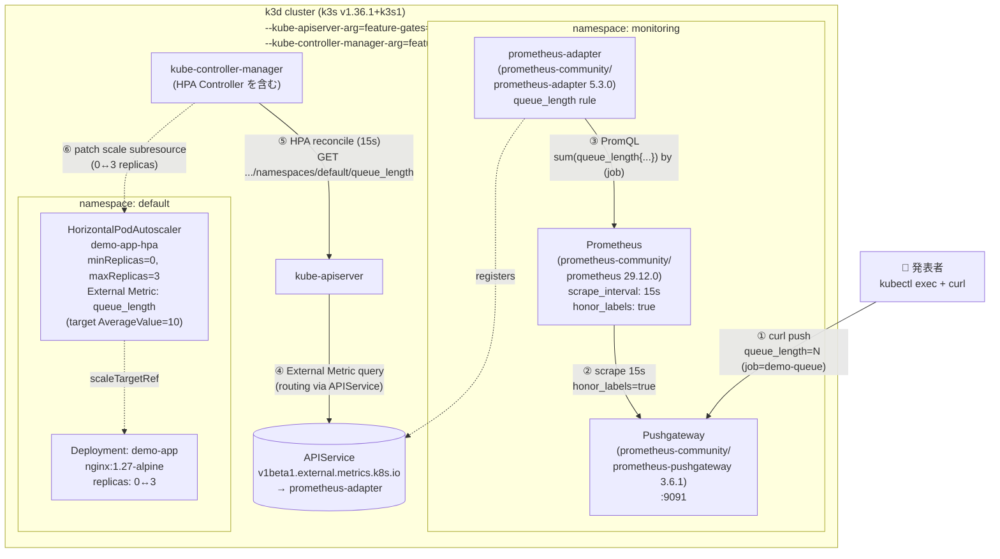
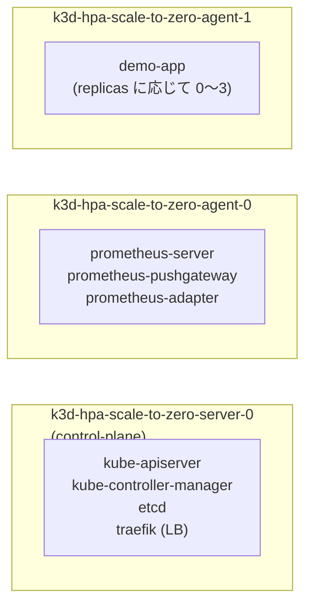
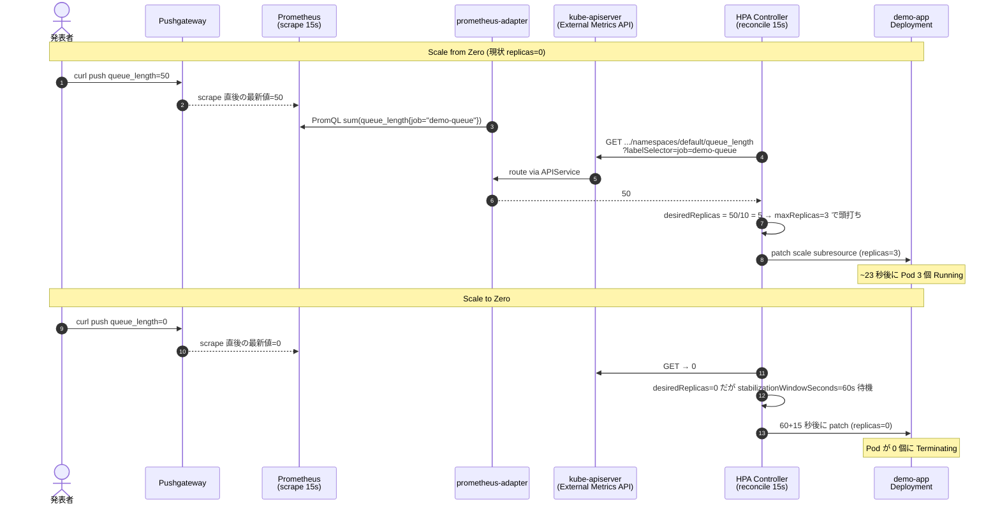

# LT 用 Kubernetes インフラ構成図

`infra/k3d-config.yaml` + `infra/helmfile-lt.yaml` + `infra/manifests/lt-demo/` で構築されるインフラの全体像。
Kafka 構成から Pushgateway 構成へ完全に置き換えたあとの版。

## 全体図

## ノード配置

## データの流れ (Scale from Zero / Scale to Zero)

## 構成要素まとめ

| Layer | コンポーネント | バージョン | 役割 |
|---|---|---|---|
| クラスタ | k3d (k3s) | v1.36.1+k3s1 | `HPAScaleToZero` Feature Gate を kube-apiserver / kube-controller-manager 両方で有効化 |
| Metrics 入口 | Pushgateway | 3.6.1 | 発表者の `curl` で push された値を保持。Pod=0 でも値が存在する性質を提供 |
| Metrics 保管 | Prometheus | 29.12.0 | 15s 間隔で Pushgateway を scrape。`honor_labels: true` で `job` を保持 |
| Metrics API ブリッジ | prometheus-adapter | 5.3.0 | `queue_length` を External Metrics API (`v1beta1.external.metrics.k8s.io`) に公開 |
| スケール対象 | nginx Deployment | 1.27-alpine | 1コンテナのみ。実処理はしない (Scale to Zero の動作実証用) |
| スケール制御 | HPA (autoscaling/v2) | — | `minReplicas=0, maxReplicas=3`、scaleUp.policies で **Pods=3 を必須に**含める |
