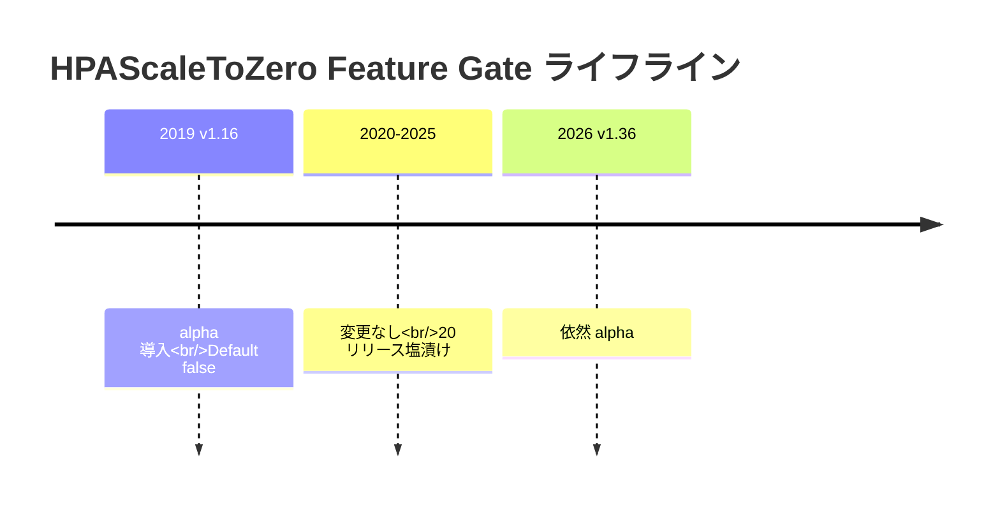
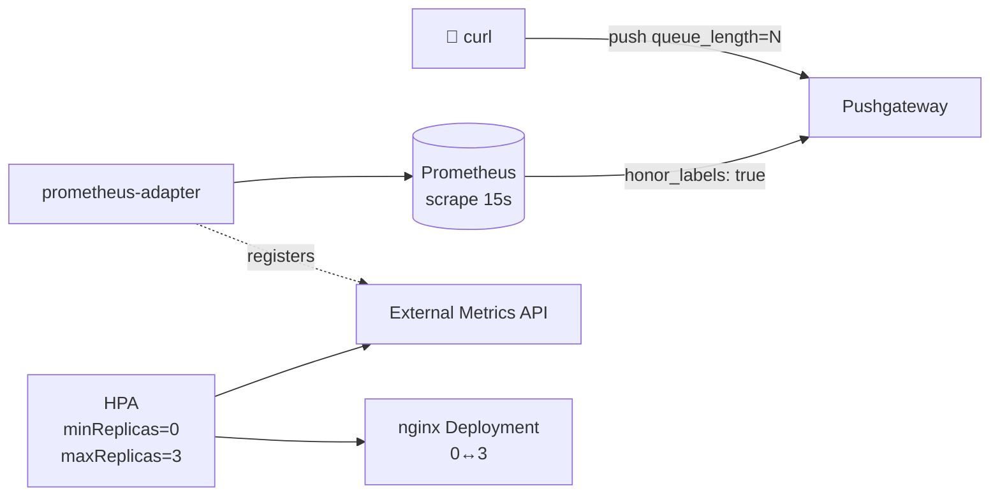

# LT スライド構成 (7 分 / Pushgateway 構成版)

K8s v1.36 alpha `HPAScaleToZero` Feature Gate を本物で動かして検証した話。
**KEDA は省略**、**Kafka は省略**、Pushgateway 構成で「最小コストの Scale to Zero」を実証する。

- 想定時間: **7 分**
- スライド枚数: **11 枚** (1 枚あたり平均 38 秒)
- メインメッセージ: **「K8s 本体にも Scale to Zero がある、本物として動く、ただしマネージドでは使えない」**

---

## スライド構成

### スライド 1 (0:00 - 0:30) — タイトル + 自己紹介

```
タイトル: K8s alpha の HPAScaleToZero を本物で動かしてみた
サブ:     7 年塩漬けの Feature Gate を有効化して挙動を計測した話
発表者:   井上佑亮 (Sreake インターンシップ)
日付:     2026-XX-XX
```

**話す内容:**
- 自己紹介 (5秒)
- 結論先出し: 「K8s 本体にも Scale to Zero があります。ただしマネージドでは使えません」(20秒)

---

### スライド 2 (0:30 - 1:00) — 問い: Scale to Zero といえば KEDA、で本当にいいの?

**スライド本文 (テキストのみ):**
```
Cloud Native × FinOps の文脈で
「アイドル時のレプリカを 0 に落とす」 = 経済合理性

→ デファクトは KEDA (CNCF Graduated)

でも...
K8s 本体にも「HPAScaleToZero」という Feature Gate が
v1.16 (2019) からあるんです
```

**話す内容:**
- KEDA はみんな知ってる、CNCF Graduated
- 実は K8s 本体にも Scale to Zero がある、知ってましたか?という問いかけ

---

### スライド 3 (1:00 - 1:45) — 驚きの事実: 7 年塩漬け

**スライド本文 (Mermaid timeline):**


ソースコード抜粋:
```go
// k8s-1.36/pkg/features/kube_features.go:1503-1505
HPAScaleToZero: {
    {Version: version.MustParse("1.16"), Default: false, PreRelease: featuregate.Alpha},
},
```

**話す内容:**
- v1.16 で alpha 導入、Default: false
- v1.36 でも alpha のまま、20 リリース以上塩漬け
- 実装が不安定だからではなく、KEP プロセスの慣性

---

### スライド 4 (1:45 - 2:30) — マネージド K8s で使えない事実

**スライド本文 (表):**
| プロバイダ | HPAScaleToZero |
|---|---|
| GKE Standard / Autopilot | ❌ flag 変更不可 |
| GKE Alpha Clusters | △ 全 alpha 強制有効、30 日寿命 |
| Amazon EKS | ❌ ([roadmap #978](https://github.com/aws/containers-roadmap/issues/978) で 6 年 open) |
| Azure AKS | ❌ ([Azure/AKS #1240](https://github.com/Azure/AKS/issues/1240) で long-pending) |
| OpenShift | △ TechPreviewNoUpgrade 制約 |
| **kubeadm / k3s / RKE** | **✅ apiserver flag で自由** |

**話す内容:**
- alpha なのでマネージドサービスは有効化できない
- 各社 issue は数年放置されている
- だから「現実問題、選択肢にならない」と言われがち
- **でも本当に動かないのか? を確かめたかった**

---

### スライド 5 (2:30 - 3:15) — 検証構成: 最小コスト構成

**スライド本文 (Mermaid flowchart):**


**ポイント:**
- k3d (k3s v1.36.1) + `HPAScaleToZero=true`
- **5 コンポーネント**しか使わない (Pushgateway / Prometheus / adapter / HPA / Deployment)
- 全部 Helm chart 1 行 (Pushgateway 3.6.1, Prometheus 29.12.0, adapter 5.3.0)
- 「Pod=0 でも存在し続ける外部メトリクス」を Pushgateway で最小コスト実装

**話す内容:**
- 外部メトリクスは何でもいい。Kafka でも Redis でも。今回は **「curl で値を直接入れられる」Pushgateway** を選んだ
- 構成図 1 枚で全部説明できるレベルの最小構成

---

### スライド 6 (3:15 - 3:45) — 実装上の落とし穴: HPA behavior の罠

**スライド本文 (YAML 抜粋):**
```yaml
behavior:
  scaleUp:
    policies:
      - type: Percent
        value: 100
        periodSeconds: 15
      - type: Pods                # ← これが無いと Scale from Zero 不可
        value: 3
        periodSeconds: 15
      selectPolicy: Max
```

**話す内容:**
- Percent 100% だけだと `currentReplicas=0` のとき `0 × 100% = 0` で動かない
- `ScalingLimited: True, reason: ScaleUpLimit` というエラーで詰む
- **Pods ポリシーが maxReplicas 値まで含まれていることが必須**
- これ、公式ドキュメントの目立つ場所には書いてない (知らないとハマる)

---

### スライド 7 (3:45 - 4:45) — 実測 (1): Scale from Zero

**スライド本文 (時系列テーブル + デモ写真 or GIF):**

```
[t=00s] $ ./lt-push.sh 50    (push queue_length=50)
[t=00s] HPA: TARGETS=<unknown>/10  REPLICAS=0
[t=30s] HPA: TARGETS=16667m/10     REPLICAS=0→3  ← scale up!
[t=35s] Pods: Running 3/3
```

**測定値 (n=5 平均):**
- **Scale from Zero: 約 30〜35 秒**
- 内訳: Prometheus scrape (~7-8s) + HPA poll (~7-8s) + adapter cache + Pod startup (~2s)

**話す内容:**
- 50 を push してから 30 秒前後で 0 → 3 replicas に
- これは「Prometheus 15s scrape + HPA 15s poll」の **構造的なレイテンシ**
- KEDA との比較では KEDA が約 14s で速かった (今回は KEDA 話はしない)

---

### スライド 8 (4:45 - 5:30) — 実測 (2): Scale to Zero

**スライド本文 (時系列テーブル):**

```
[t=00s]  $ ./lt-push.sh 0    (push queue_length=0)
[t=15s]  HPA: TARGETS=0/10   REPLICAS=3 (stabilization 待機開始)
[t=75s]  HPA: REPLICAS=3→0   ← scale to zero!
```

**測定値 (n=5):**
- **Scale to Zero: 75.0 秒 (σ=0)**
- `scaleDown.stabilizationWindowSeconds: 60s` + 経路遅延 15s = **完全な決定論的タイマー**

**話す内容:**
- 0 を push したあと、ぴったり 75 秒で 0 replicas になる
- 60s は **stabilization (誤検知でスケールダウンしないための保護)**
- 残りの 15s は scrape + poll の最大値
- n=5 で σ=0 = 完全に再現性あり

---

### スライド 9 (5:30 - 6:00) — なぜ Scale to Zero は決定論的なのか

**スライド本文 (要点 3つ):**

```
①  HPA の scaleDown は stabilizationWindowSeconds でゲートされる
   → コード上で「desiredReplicas <= currentReplicas が連続 60s」を要求

②  Prometheus → adapter → API 経路の遅延は安定 (~15s)
   → スパイクが無い限り決定論的

③  実装が「待つ」設計なのでバラつきが乗らない
   → σ=0 はバグではなく仕様どおり
```

**話す内容:**
- 「タイマーで待つ」設計なので分散ゼロ
- これは KEDA も同じ (cooldownPeriod=60s でゲート)
- **「Scale to Zero のレイテンシは設定値で決まる」というメッセージ**

---

### スライド 10 (6:00 - 6:30) — 結論: マネージド対応と KEDA との関係

**スライド本文 (採用判断):**

```
✅ セルフホスト (k3s / kubeadm / RKE) なら使える
❌ マネージド (GKE / EKS / AKS) では使えない
🤝 KEDA は別軸の解 (External Metrics API を独自実装で代替)

→ 設計の本質は「Object/External Metric を見て scale」 で同じ
→ 適用環境で使い分け
```

**話す内容:**
- 結局のところ、運用環境次第
- マネージド使うなら KEDA 一択
- セルフホスト + 外部 operator 入れたくないなら HPAScaleToZero alpha が選択肢
- ただし「3 コンポーネント (Prometheus + adapter + Pushgateway)」必要なので、KEDA より構成は重い

---

### スライド 11 (6:30 - 7:00) — まとめ + リポジトリ

**スライド本文:**

```
本日のテイクアウェイ:
  1. K8s alpha の HPAScaleToZero は本物として完全に動く
  2. ただし v1.36 でも alpha のまま、マネージド K8s では使えない
  3. レイテンシは設計どおり (Scale to Zero は完全決定論的)
  4. Pushgateway 経由で最小コスト (5 コンポーネント) 構成が組める

リポジトリ:
  github.com/cyokozai/hpa-scale-to-zero
  - infra/ : helmfile + manifest 全部
  - docs/  : コード解析 + 検証データ + ブログ草稿
  - scripts/ : 自動計測スクリプト

[QR コードを貼る]
```

**話す内容:**
- 4 点要約
- リポジトリに全部ある (再現可能、5 分で構築できる)
- ご清聴ありがとうございました

---

## 補助情報

### デモを入れる場合 (5-8 枚目あたり)

スライド 7-8 (Scale from Zero / Scale to Zero) の代わりに、**ライブデモ枠**を 2 分挿入することもできる。

```
スライド 7 (4:00 - 6:00) — LIVE DEMO
$ ./scripts/lt-push.sh 50  
$ kubectl get hpa demo-app-hpa -w  
... 30秒待つ ...
$ ./scripts/lt-push.sh 0
$ kubectl get hpa demo-app-hpa -w
... 75秒待つ ...
```

- 利点: 視聴者の印象に残る
- 欠点: ネットワーク・kubectl の表示テンポに依存、失敗リスクあり
- 推奨: **デモは事前収録動画 (asciinema 等)** にして再生する方が安全

### 時間が余ったとき (バッファ枠)

- マネージド K8s 各社の issue を 1-2 個ピックアップして紹介
- Pods policy 罠の体験談を詳しく語る
- KEDA との比較に軽く触れる (n=20 計測ベースで「KEDA は約 14s」)

### 時間が足りないとき (削減候補)

優先削減順:
1. スライド 6 (落とし穴) → 詳細は QR コードから
2. スライド 9 (なぜ決定論的) → ファクトだけ示せばよい
3. スライド 4 (マネージド対応) → 表だけ見せて 15 秒で済ます

---

## ビジュアル方針

- **モノクロベース + 1 色アクセント** (HPA 関係は青系、警告は赤)
- 各スライドにキーメッセージを 1 つだけ太字で書く
- グラフは matplotlib 既存 figures (`fig1-comparison-bars.png` 等) を流用可能
- Mermaid 図はそのままレンダリングして貼る

## 想定 Q&A

| 質問 | 答え |
|---|---|
| n=20 取ってたデータは? | あります。ブログに掲載。LT 内では n=5 をベースに語った |
| KEDA との比較は? | あります。LT では時間の都合で省略。Scale from Zero は KEDA が ~10s 速い |
| Pushgateway 以外でもいい? | はい。Redis / SQS / 自作メトリクス何でも OK |
| なぜ k3d? | マネージドで feature gate 弄れないため。k3d なら 5 分で再現可能 |
