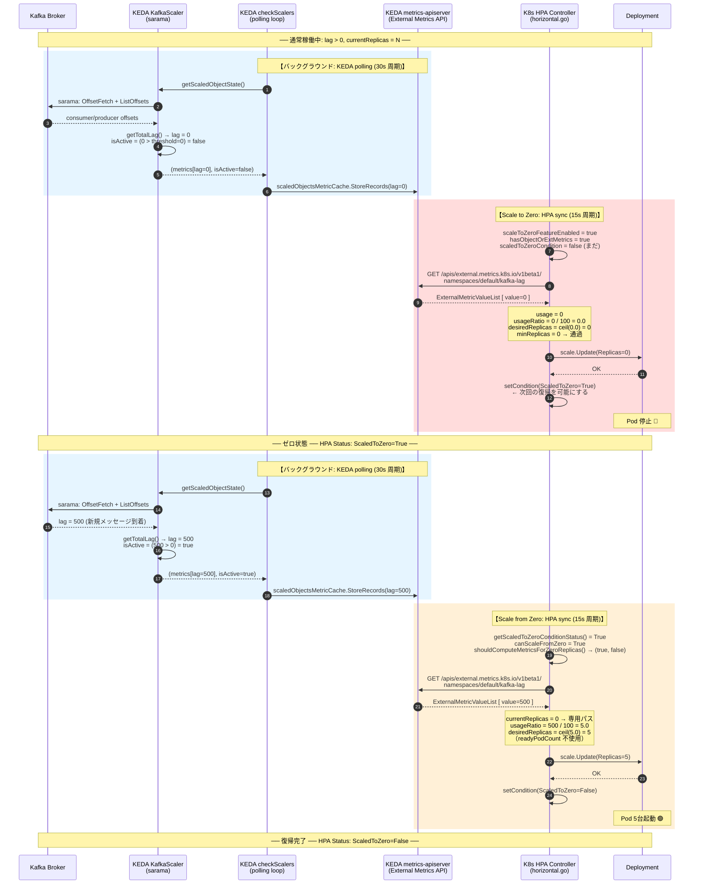
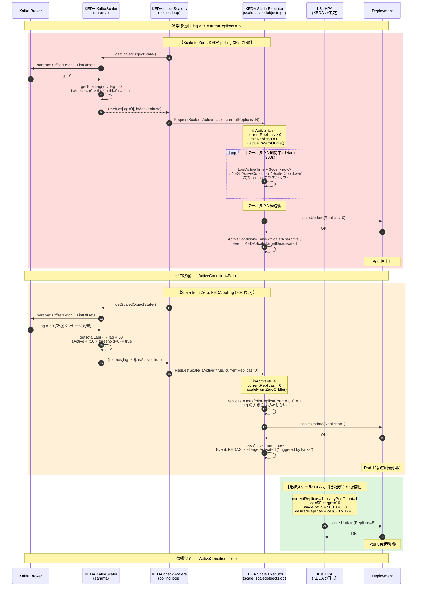
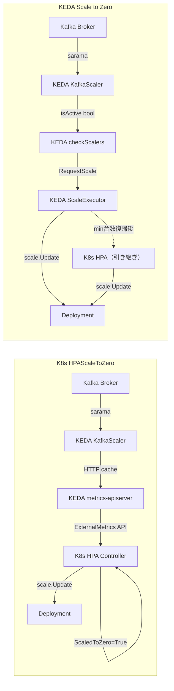

# Scale to Zero / from Zero 往復比較シーケンス図

## 登場コンポーネント

| コンポーネント | K8s HPAScaleToZero | KEDA |
|---|---|---|
| メトリクス取得 | KEDA metrics-apiserver（HTTP）経由 | KafkaScaler が sarama で直接 |
| アクティブ判定 | HPA Controller が Condition を評価 | Scale Executor が isActive を評価 |
| ゼロ実行者 | K8s HPA Controller | KEDA Scale Executor |
| 復帰実行者 | K8s HPA Controller | KEDA Scale Executor（その後 HPA が引き継ぎ） |
| 状態の記録 | HPA Status: `ScaledToZero=True` | ScaledObject Status: `ActiveCondition=False` |

---

## K8s HPAScaleToZero — 往復シーケンス

> **読み方:** KEDA は KafkaScaler（メトリクス取得）と metrics-apiserver（HTTP エンドポイント）の役割のみ担う。
> Scale to/from Zero の判断と実行は K8s HPA Controller が行う。



### K8s のポイント

| フェーズ | 詳細 |
|---|---|
| **メトリクス取得** | KEDA の polling loop がキャッシュを更新 → HPA は HTTP でキャッシュから読む |
| **Scale to Zero 判断** | `desiredReplicas = 0`（メトリクス計算の結果） |
| **ゼロ後の状態記録** | `ScaledToZero=True` Condition を HPA オブジェクト（etcd）に書き込む |
| **復帰トリガー** | 次の HPA sync で `canScaleFromZero=true` を確認してメトリクス計算に進む |
| **復帰レプリカ数** | `ceil(lag / target)` — 一気に適正台数へ（例: lag=500, target=100 → 5台） |

---

## KEDA — 往復シーケンス

> **読み方:** KEDA の polling loop が Kafka Broker に直接接続し、`isActive` フラグで
> Scale to/from Zero を制御する。K8s HPA は「ゼロ→最小台数」の後の継続スケールのみ担当。



### KEDA のポイント

| フェーズ | 詳細 |
|---|---|
| **メトリクス取得** | sarama で Kafka Broker に直接 TCP 接続（OffsetFetch + ListOffsets を並行取得） |
| **Scale to Zero 判断** | `isActive=false`（Scaler が返す bool） |
| **クールダウン** | デフォルト **300秒**。`LastActiveTime` からカウント。K8s HPA には相当機能なし |
| **ゼロ後の状態記録** | `ActiveCondition=False` + Kubernetes Event（Condition 不要で復帰できる） |
| **復帰トリガー** | `isActive=true` になった**その同じ polling 周期**で即座に実行 |
| **復帰レプリカ数** | `max(minReplicaCount, 1)` = 最小台数から起動、その後 HPA が追加スケール |

---

## 設計差異の対比



---

## 往復タイムライン比較

```
K8s HPAScaleToZero
─────────────────────────────────────────────────────────────────────────▶ 時間
t=0    t=15s   t=30s   t=45s   t=60s
│       │       │       │       │
│ lag=0 │       │ lag>0 │       │
│ ←KEDA polling→       │
│       │ HPA sync      │ HPA sync
│       │ desiredReplicas=0     │ canScaleFromZero=true
│       │ scale.Update(0)       │ desiredReplicas=5
│       │ ScaledToZero=True     │ scale.Update(5)
│       │                       │ ScaledToZero=False
        ↑                       ↑
     ゼロへ                  復帰完了
     (待機なし)             (+約 15s)


KEDA Scale to Zero
─────────────────────────────────────────────────────────────────────────▶ 時間
t=0   t=30s  t=60s  ... t=5min  t=5min+30s
│      │      │           │         │
│ lag=0│      │           │  lag>0  │
│ ←KEDA polling→         │
│      │ isActive=false   │ isActive=true
│      │ scaleToZeroOrIdle│
│      │ [cooldown 300s]  │ scaleFromZeroOrIdle
│      │ ...cooldown中... │ scale.Update(1)
│                 │       │ +HPA → scale.Update(5)
│          scale.Update(0)│
          ↑               ↑
       ゼロへ          復帰完了
  (lag=0から+5分)     (lag>0の次polling)
```

---

## 主要な設計差異まとめ

| 観点 | K8s HPAScaleToZero | KEDA Scale to Zero |
|---|---|---|
| **Kafka 接続** | External Metrics API 経由（HTTP）| sarama で直接 TCP 接続 |
| **アクティブ判定の場所** | HPA Controller 外部（Condition を見る）| Scaler 内部（bool を返す） |
| **Scale to Zero の速さ** | 次の HPA sync（約 15s） | 次の polling（約 30s）+ クールダウン（300s）|
| **Scale from Zero の速さ** | 次の HPA sync（約 15s） | 次の polling（約 30s） |
| **初回復帰レプリカ数** | `ceil(lag / target)`（適正台数に一気に） | `max(minReplicaCount, 1)`（最小台数から） |
| **状態の保存先** | HPA Status Conditions（etcd に永続化） | ScaledObject Status（+ 毎回再計算）|
| **復帰の必要条件** | `ScaledToZero=True` Condition が必須 | `isActive=true` だけで復帰可能 |
| **スラッシング対策** | `behavior.scaleDown.stabilizationWindowSeconds` | クールダウン期間（明示的）|
| **CPU/Memory 制限** | `hasObjectOrExternalMetrics()` で弾く | `cpuMemCount` で強制 `isActive=true` |
